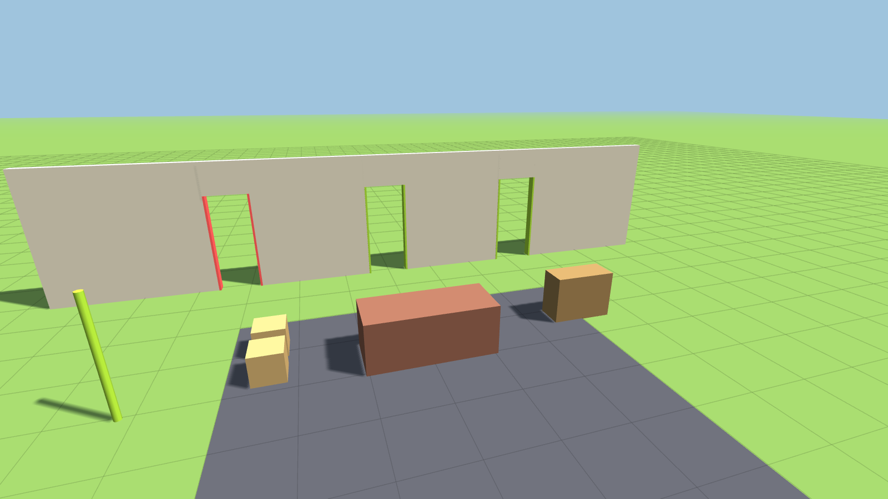

# Movers From Hell

### ▶ Play it: **https://dumb-tony.github.io/MoversFromHell/**

Always live, always the current `main`. Every push redeploys it — no build step, the repo
*is* the site. **Phase 0 of 13**, so right now that link shows the diagnostic scene with a
mouse-look camera; there is no character to move yet. Phase 1 adds one.

---

A 1–4 player physics-driven moving-company co-op game. You and your friends carry
furniture down stairs, through doorways it does not fit through, into a truck that is a
real collision volume, drive it somewhere, and find out what your packing was worth.

**North-star question:** is physically moving furniture with friends, packing a truck,
driving it, and unloading it inherently fun enough to build a full game around?

The full design authority is [`docs/GDD.md`](docs/GDD.md) (29 sections). This README
covers only how to run and build the thing.

---

## Platform strategy — read this before adding anything

This browser build is a **gameplay laboratory, not the final foundation** (GDD §13, §24).
It exists to answer the north-star question. After the core loop is proven fun, the
project transitions to a real 3D Unity PC game for Steam. Prototype code is expected to be
thrown away; validated *rules, tuning ranges and playtest evidence* are what transfer.

A feature-complete prototype that is not fun is a **failed prototype**, and should be
revised rather than expanded (§13.5).

---

## Run it

Live build, no install: **https://dumb-tony.github.io/MoversFromHell/**

Locally, for development:

```bash
./play.bat
```

Serving over http is required, not a convenience — the game is ES modules, and browsers
block module loads on `file://`. `play.bat` starts `tools/serve.ps1` on ports 8381–8390
and opens a tab. Those ports sit clear of Chameleon (8321–30), Something's Different
(8341–50) and Airport Baggage Crew (8361–70) so all four can run at once.

Click the canvas to capture the mouse. `Esc` pauses and releases it. `F3` toggles the
developer overlay.

## Test it

```bash
powershell -ExecutionPolicy Bypass -File tools\smoketest.ps1
```

There is no Node.js on this machine, so **the harness is a browser**: it injects the suite
into a scratch copy of `index.html`, serves it, drives it in headless Chrome, and greps the
dumped DOM. Exit code 0 means all assertions passed.

Screenshots for docs and layout checks:

```bash
powershell -ExecutionPolicy Bypass -File tools\shot.ps1 -Setup tools\_shot-phase0.js -Out docs\phase0-scene.png
```

---

## Current state — Phase 0 complete

GDD §25.2 defines a 13-phase roadmap. Phase 0 is *"standalone launch, scene, action map,
debug overlay, fixed loop"*, gated on *"loads locally; stable frame/step"*.

**118 assertions, all passing.** What exists:

| Piece | Where | Notes |
|---|---|---|
| Fixed-step clock | `src/core/clock.js` | Accumulator, long-frame clamp, pause, `alpha`. Time is conserved: sim + banked = fed. |
| Action map | `src/core/input.js` | Per-context bindings (foot/drive), keyboard + mouse + gamepad, analog triggers, hold/toggle grip. |
| Event bus | `src/core/eventBus.js` | GDD §23.3 vocabulary declared; bounded log. |
| Seeded RNG | `src/core/rng.js` | `mulberry32`; the same contract id always yields the same contract. |
| Game state | `src/game.js` | Serializable, string-keyed players, total pause by construction. |
| Third-person camera | `src/render/camera.js` | Occlusion pull-in, asymmetric smoothing, clamped pitch. |
| Diagnostic scene | `src/render/scene.js` | Three doorways, a real couch, a metre grid. |
| Debug overlay | `src/dev/debugOverlay.js` | FPS, step timing, clamped frames, phase, input context. |
| Named tuning | `src/config.js` | Every §27.5 high-leverage value has a home. Most are **placeholders**, marked as such. |



### The finding that shaped the scene

The GDD's own couch (`couch_3seat_01`, §7.1) is 2.10 × 0.90 × 0.85 m. A rigid box passes a
slot of width *g* if and only if `min(w, h) ≤ g` — every intermediate rotation angle is
worse than both endpoints, so the couch's narrowest possible presentation is **0.850 m, in
every orientation, forever**.

| Doorway | Clear width | Result |
|---|---|---|
| 32″ interior | 0.82 m | **Impossible.** Short by 30 mm. |
| 34″ door | 0.86 m | Passes on its side, 10 mm to spare. |
| 36″ front door | 0.91 m | Passes on its side by 60 mm; face-on by 10 mm. |

All three are built into the Phase 0 wall — coral jambs mean the couch cannot pass, lime
means it can. This is a design question for §8.2, not a bug: see
[`docs/KNOWN_ISSUES.md`](docs/KNOWN_ISSUES.md).

---

## Architecture

```
index.html          crash banner, vendored THREE, module entry
src/
  config.js         ALL tuning. §27.5 high-leverage values live here and nowhere else.
  game.js           authoritative state + fixed-step loop. Every mutation runs in step().
  main.js           boot, system registration, render loop
  core/             clock, input, eventBus, rng   — engine-agnostic, no THREE, no DOM
  render/           renderer, camera, scene       — reads state, never writes it
  dev/              debugOverlay
  physics/ objects/ tools/ vehicle/ contract/ ui/ data/   — empty, one per §22.2 module
assets/lib/r128/    vendored Three.js — zero external requests
tools/              serve, smoketest, shot, per-phase test suites
docs/               GDD (markdown + original .docx), screenshots, changelog, issues, notes
```

Three rules keep the §22.4 multiplayer seam open even though this build is single-player:
players are keyed by stable string id, state is plain serializable data with no engine
handles in it, and systems observe state rather than owning it.

### Reuse lineage

Per `Dev\INDEX.md`, most of the scaffold was copied rather than written:

- `GameClock`, `Rng`, `EventBus`, the `Input` edge-per-step contract, the whole test
  harness (`serve.ps1` / `smoketest.ps1` / `shot.ps1`) — **Airport Baggage Crew**
- `camOcclude` analytic ray-vs-AABB — **Chameleon** (`chameleon3d.html:4198`)
- Crash banner — **Something's Different** (`somethingsdifferent.html:444`) via ABC
- Three.js r128 — the same vendored build Chameleon and Something's Different use, which
  is what lets their camera/texture/animation code drop in unported

Names were kept so the lineage stays greppable.

## Known limitations

- **Must be served over http.** ES modules are blocked on `file://`. Use `play.bat`.
- **No physics engine yet.** Rapier3D is the chosen solver (vendored, offline) but is not
  yet present — Phase 2 introduces it. Phase 0 needs no bodies.
- **Most of `config.js` is unvalidated.** Every block below `SIM` and `RENDER` is a named
  placeholder, labelled with the phase that will validate it. Do not quote them as balance.
- **Headless Chrome delivers 1–3 rAF callbacks total** in `--dump-dom` mode (measured; see
  `Dev\INDEX.md`). Test suites must drive `game.frame()` directly, never wait for frames.
