# Movers From Hell

### ▶ Play it: **https://dumb-tony.github.io/MoversFromHell/**

Always live, always the current `main`. Every push redeploys it — no build step, the repo
*is* the site. **Phase 10 of 13**: a house to empty, two movers, four tools, a truck with a
real cargo box, a drive that finds out how well you packed it, a second house to fill, and an
invoice that prices every mistake you made getting there. WASD move, Shift sprint/brace,
Space jump/mantle, **LMB/RMB to grab with each hand**, **E to use and Q to undo**, **Tab to
swap mover**, **F2 for two-player split-screen**, R recover, F3 stats. Try carrying the couch
on your own — it will slow you down, unbalance you, and eventually put you on the floor. That
is the design, not a bug. Then grab one end, Tab to the other mover, grab the other end, and
watch it come off the ground — or press F2 and have someone else grab it.

---

> ### ⚠ What you can actually reach right now
>
> **All of it.** Phases 6–10 were built physics-first and each deferred its interface, so for
> a while the tools, straps, cargo loading, the drive and the invoice were real, measured and
> asserted — and unreachable, because none of them had an input binding. That gap is closed:
> **E does the obvious thing and Q undoes it** (§9.2), the HUD tells you which before you
> press it (§4.4), straps are drawn (§10.3), and the contract ends on a settlement screen you
> can replay from (§15.2).
>
> **It also looks like a game now, with a chosen art direction** — TOY: rounded chunky
> geometry, saturated colour, hard warm light, a crew with toy proportions whose arms reach
> to what they are holding. Picked from three in-engine options; `?style=cel` and
> `?style=film` remain live if you want to see the roads not taken.
>
> **And two people can play it.** Press **F2** for split-screen local co-op: P1 on WASD and
> the mouse, P2 on the arrow keys or the first controller plugged in. §6.4's two-mover
> carrying has been real and measured since Phase 4 and this is the first build in which two
> people can actually do it.
>
> What is *not* here: online play. §14.1's production target is 1–4 over Steam and nothing
> here is networked — the seams are open (§22.4) but unused. See
> [KNOWN_ISSUES.md](docs/KNOWN_ISSUES.md).

A 1–4 player physics-driven moving-company co-op game. You and your friends carry
furniture down stairs, through doorways it does not fit through, into a truck that is a
real collision volume, drive it somewhere, and find out what your packing was worth.

**North-star question:** is physically moving furniture with friends, packing a truck,
driving it, and unloading it inherently fun enough to build a full game around?

The full design authority is [`docs/GDD.md`](docs/GDD.md) (29 sections). This README
covers only how to run and build the thing.

---

## Platform strategy — read this before adding anything

This browser build is a **gameplay laboratory, not the final foundation** (GDD §13, §24).
It exists to answer the north-star question. After the core loop is proven fun, the
project transitions to a real 3D Unity PC game for Steam. Prototype code is expected to be
thrown away; validated *rules, tuning ranges and playtest evidence* are what transfer.

A feature-complete prototype that is not fun is a **failed prototype**, and should be
revised rather than expanded (§13.5).

---

## Run it

Live build, no install: **https://dumb-tony.github.io/MoversFromHell/**

Locally, for development — **double-click `play.bat`**, or:

```bash
./play.bat
```

⚠ Start it from a terminal or Explorer window you keep open. A dev server launched as a
background task from an agent session does not survive: it binds, serves correctly, and is
then torn down within a minute (observed exiting 255 and 1, with no error of its own). The
server is fine; the background lifetime is not. It also prints the port it actually got —
read that line, because several projects scan the same range.

Serving over http is required, not a convenience — the game is ES modules, and browsers
block module loads on `file://`. `play.bat` starts `tools/serve.ps1` on ports 8381–8390
and opens a tab. Those ports sit clear of Chameleon (8321–30), Something's Different
(8341–50) and Airport Baggage Crew (8361–70) so all four can run at once.

Click the canvas to capture the mouse. `Esc` pauses and releases it. `F3` toggles the
developer overlay.

## Test it

```bash
powershell -ExecutionPolicy Bypass -File tools\smoketest.ps1
```

**The harness is a browser**, because the thing under test is: Rapier is WASM, Three needs a
GL context, and the HUD is DOM. The suite is injected into a scratch copy of `index.html`,
served, driven in headless Chrome, and the dumped DOM is grepped for the result block. Exit
code 0 means all assertions passed.

Node **is** installed, contrary to what this file said for eleven phases, and a syntax gate
before every browser run is worth it — ~40 ms against roughly 90 seconds to discover the
same typo as a blank page and an error banner:

```bash
./tools/syntax-check.sh
```

⚠ **Use the script, not `node --check src/foo.js`.** `--check` parses a `.js` file with the
CommonJS goal, and rather than rejecting module syntax it exits **0**. Measured with Node
v24.18.1: a file with one `import` spliced into the middle of another passed `--check` as
`.js` and failed as `.mjs`. All of `src/` is ES modules, so the cheap gate had a blind spot
shaped exactly like the code it was guarding. The script copies to `.mjs` first, which is
what actually sets the parse goal. Neither form can run the suites — no DOM, no WebGL, no
`window.THREE`.

Screenshots for docs and layout checks:

```bash
powershell -ExecutionPolicy Bypass -File tools\shot.ps1 -Setup tools\_shot-phase0.js -Out docs\phase0-scene.png
```

---

## Current state — Phase 10 complete, playable, two-player, and dressed

GDD §25.2 defines a 13-phase roadmap.

| Phase | Gate | State |
|---|---|---|
| 0. Scaffold | loads locally; stable frame/step | done — 118 assertions |
| 1. Movement | responsive indoors and on ramp | done — 61 assertions |
| 2. One box | controllable; no wall ghosting | done — 66 assertions |
| 3. Heavy object | weight legible without hard denial | done — 61 assertions |
| 4. Cooperative seam | multiple grips combine predictably | done — 59 assertions |
| 5. House puzzle | all objects recoverable and movable | done — 61 assertions |
| 6. Tools | each solves a physical problem | done — 66 assertions |
| 7. Cargo | secured pack remains stable | done — 53 assertions |
| 8. Drive | poor pack shifts or damages visibly | done — 38 assertions |
| 9. Destination | manifest completes reliably | done — 41 assertions |
| 10. Economy | ledger matches events | done — 45 assertions |
| 11. Playtest | external groups complete and replay | next — and it is the only one that matters |

Plus four increments that are not on the roadmap. **The playable layer** gave phases 6–10 the
input bindings and HUD each of them had deferred. **Local co-op** gave §6.4's second pair of
hands to a second person. **The art pass** dressed a build that §20.4 had deliberately kept
diagnostic for twelve phases. **The toy pass** committed that dressing to a direction. None of them is §25.2's Phase 11 — that one is the playtest,
it is next, and the last two are what make it possible to run with strangers.

**857 assertions across fourteen suites, all passing.**

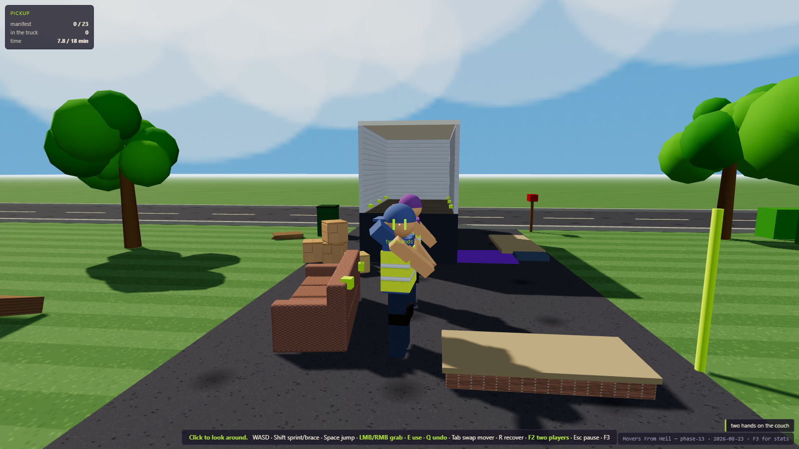

Two movers carrying a couch, all four arms reaching to it — the game's thesis in one image.
The art direction is **TOY**, chosen from three photographed options (`?style=cel` and
`?style=film` stay live for the comparison): rounded chunky geometry everywhere, saturated
colour, hard warm light, and crew with toy proportions whose hands sit on their actual grip
points. The couch is still exactly 2.10 m and still will not fit the 32" door — every rounded
prefab is measured against its own collider to the millimetre (m13 A1), because §13.4's
collision-faithful rule outranks any art direction.

An art pass is the most dangerous change this project can make, because its mistakes are
invisible to every test that came before it — so `m13` measures the boundary between what you
see and what the physics does. **16 of 16 prefabs fit inside their own colliders to the
millimetre; zero meshes intrude on any of the three doorways; the roof, trees, hedge, street
and kerbs add zero colliders.**

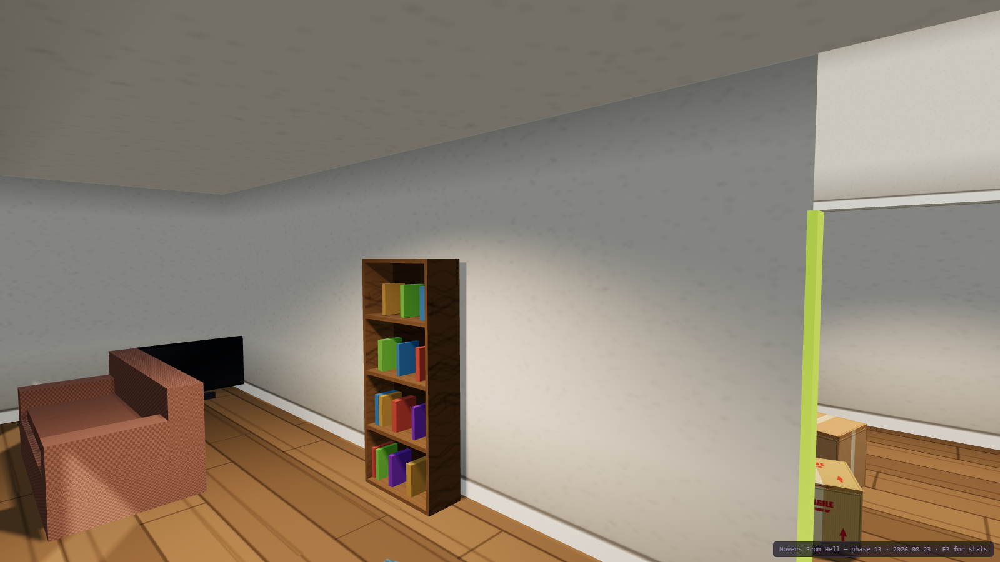

The interior, which was the weakest part of the art pass until the cause turned out not to be
the lighting at all. **`MeshLambertMaterial` shades per vertex** — a wall is two triangles, so
its lighting was computed at four corners and interpolated across ten metres, and hanging
lamps in the rooms would have changed almost nothing. Surfaces are per-fragment now, each room
has a warm shadow-casting spot, and the skirting board and contact darkening are baked into
the plaster because a real-time rig with no AO pass has none of its own.

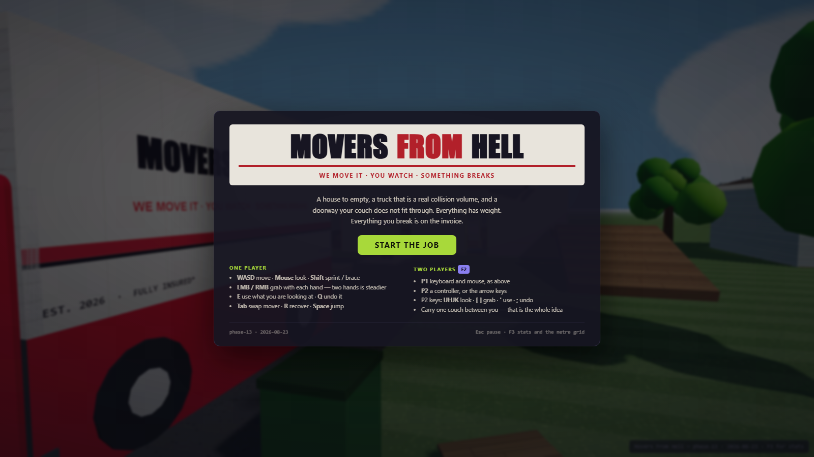

§13.4's "compact job-start screen rather than a full headquarters" — one card, one button,
and the only honest place to tell anyone that two people can play. The simulation is never
paused for it: the world behind the blur is the game running.

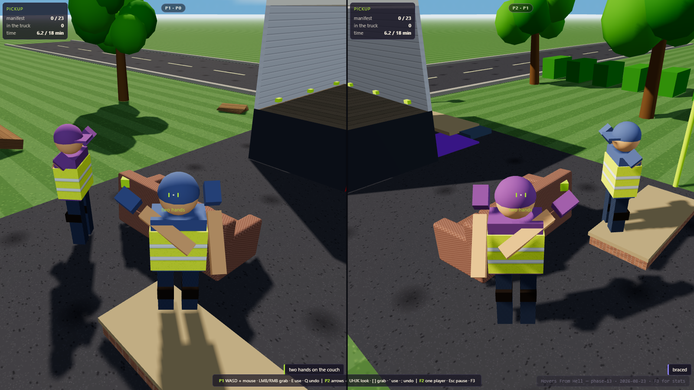

§6.4's worked example, with a player at each end for the first time: *"opposite-end grips
naturally stabilise long objects"*. Both halves are the shipping build's — its cameras, its
split layout, its HUDs — and both reticles read **two hands** because both movers really are
gripping the one couch. The physics under this has been right and asserted since Phase 4;
what was missing for eight phases was a second seat.

Split-screen is a **deliberate departure from §13.4**, which excludes it from the prototype.
It is recorded as a product decision in the changelog, and it is forced rather than chosen:
`GripSystem.aim()` derives its ray from the camera rig, so two movers sharing one camera aim
in the same direction and reach for the same thing.

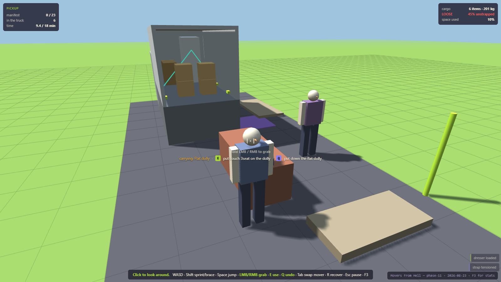

§9.2's one interaction verb, showing its work: a mover carrying the flat dolly, looking at
the couch, with the HUD naming both halves of the decision before either key is pressed —
`E put couch 3seat on the dolly`, `Q put down the flat dolly`. Behind them the truck is
part-loaded and two straps are drawn from their anchors over the cargo (§10.3), the contract
panel is nine minutes into an eighteen-minute estimate, and the cargo panel is calling the
pack **45% unstrapped** in red. Every panel in that frame is the shipping build's own.

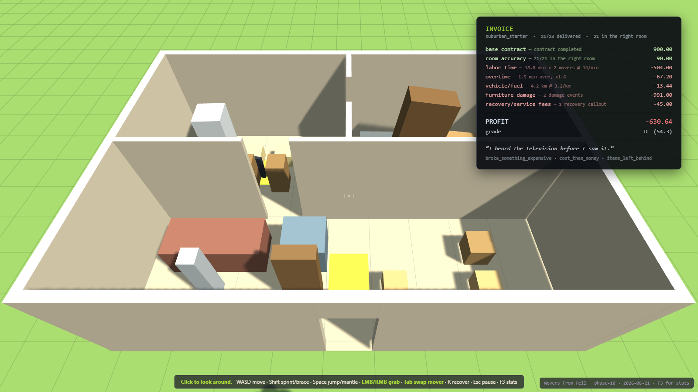

§15.1's invoice, on a real contract: 21 of 23 items delivered, all in the right rooms,
ninety seconds over the estimate, one television destroyed on the way in. Every line names
the events it came from — item damage is the §8.4 ledger written *as the impacts happened*,
never recomputed at settlement — and `reconcile()` re-derives the whole thing from the event
records. It refuses an invoice with a charge nothing caused, and one that drops a ledger
entry.

The result is a **630.64 loss at grade D** on a job that went almost perfectly. One broken
television is roughly the entire margin, which is not a number anyone tuned toward: §7.1's
replacement values met §15.1's labour rate and that is where it landed.

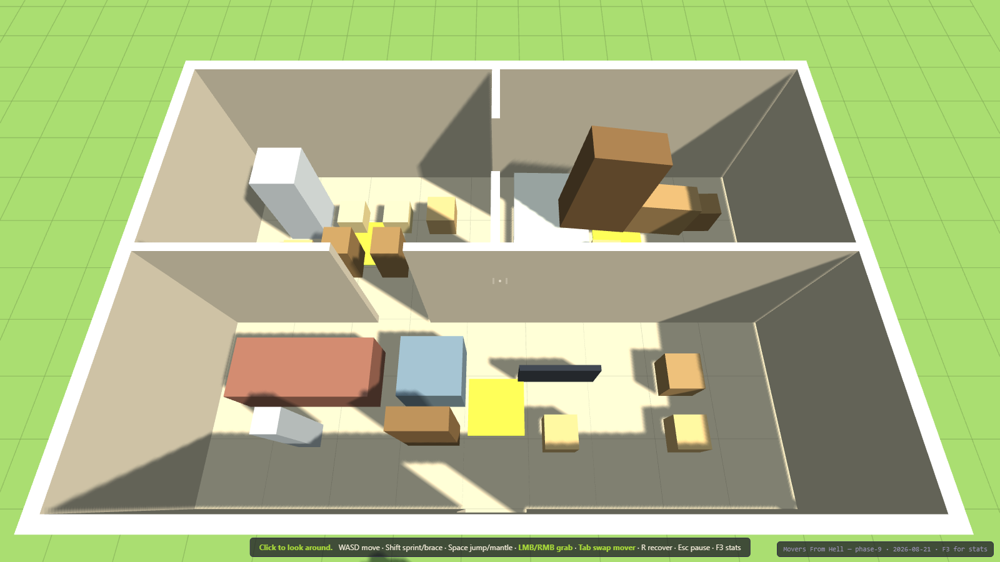

The destination with the whole manifest delivered — §13.1's "smaller site with 3-4 labeled
room zones", 54 m² against the pickup house's 70. All 23 objects settled in the rooms the
manifest asked for.

**The decision this phase had to make:** §3.4 reads wrong-room delivery as a gate, §15.1 as a
scored line, §12.2 forbids it as a hard fail. Two of three make it a price, and §2.1 breaks
the tie — **an object is delivered when it is settled inside the destination; the right room
is a separate, scored fact.** A contract completes with half the load in the wrong rooms. It
simply pays less.

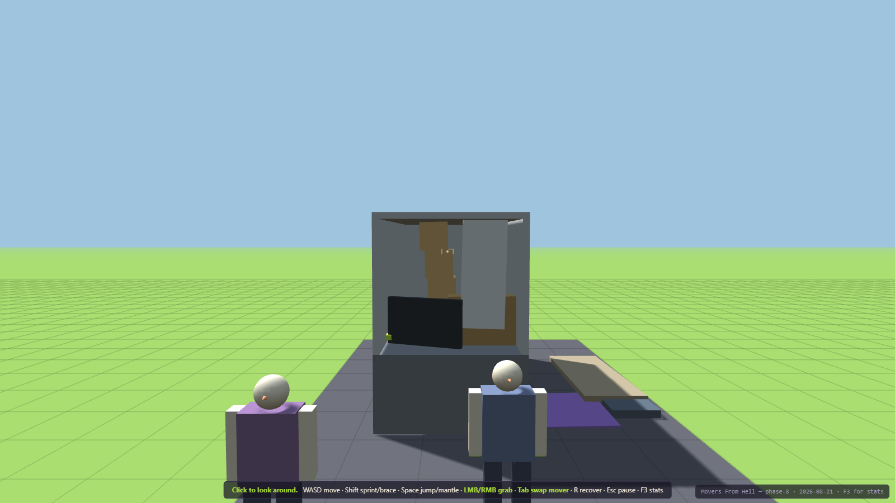

What a badly packed truck looks like on arrival. Nothing here was arranged: six objects were
placed loose and high, §13.3's route applied one hard brake, one turn and one bump as real
forces, and this is where the solver left them.

| the same route, the same objects | worst shift | damage |
|---|---|---|
| good pack — heavy low and forward, strapped | 0.470 m | **none** |
| poor pack — stacked high, loose, unstrapped | **2.615 m** | television destroyed |
| **the poor pack, parked for the same 28 s** | — | **none** |

That third row is the one that matters. The pack is identically bad and the game knows it —
and nothing happens, because §10.4's physical cause is missing. Damage is never inflicted by
a score.

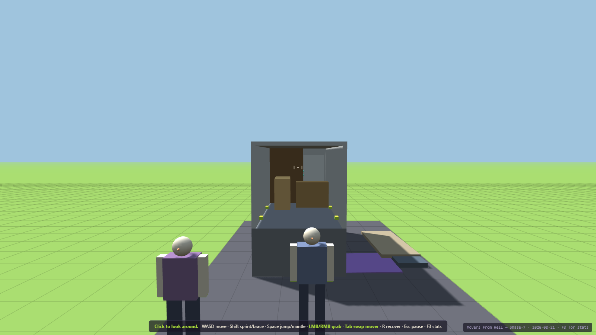

The cargo box through its open rear door: deck, walls, headboard, roof and six anchors, with
the load strapped down. §10.1 forbids the shortcut — "nothing teleports into storage" — so
there is no inventory here. An object is in the truck when it is physically in the truck.

### What Phase 7 added

| Piece | Where | Notes |
|---|---|---|
| The cargo box | `src/world/truck.js` | A real collision space with an open rear door and six anchors, built from the same records as its mesh. |
| Straps | `src/cargo/straps.js` | One-sided ropes with §10.3's four states. A rope pulls when taut and does nothing when slack — which is what makes "slack" a state rather than a small force. |
| Loading by physics | `src/cargo/cargo.js` | §10.2: cross the threshold AND settle inside. No slots, no grid, no snapping. |
| Per-surface friction | `src/physics/world.js` | A truck deck is 0.32, not a house floor's 0.8 — which is the actual reason real loads get strapped. |

**Measured, one §11.3 hard brake over the same six-item pack:** unstrapped worst shift
**1.645 m**; strapped **0.141 m**.

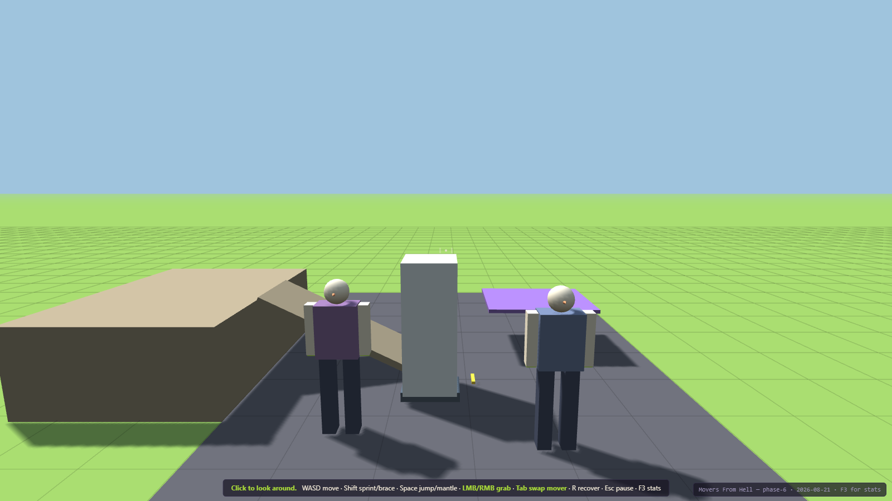

The four §9.1 tools on the driveway: the fridge up on the flat dolly, the loading ramp
against a 1.20 m deck, a moving blanket over the television, a screwdriver on the ground.
Each tool changes one physical quantity and nothing else — which is why each one's failure
mode is the same change seen from the other side.

### What Phase 6 added

| Piece | Where | Notes |
|---|---|---|
| Four tools | `src/tools/` | Dolly (friction), blanket (impact tolerance), ramp (clearance), screwdriver (dimensions). Real world bodies with mass — §9.2's "tools are world objects". |
| Tow speed limit | `src/player/grip.js` | You cannot walk faster than what you are towing can follow. A hand is a spring; walk past √(k/m)·maxStretch and the hold tears. |
| Impact-speed damage | `src/config.js` | Item damage keyed on speed, not impulse — impulse made a couch more fragile than glassware for being heavy. Property damage keeps the impulse, where mass belongs. |
| Friction combine fix | `src/tools/tools.js` | An object's declared friction is averaged with the floor's. The dolly switches to `Min` so its 8.75× cut is not delivered as 1.3×. |

**Measured:** couch hauled by one hand for 3 s — **0.00 m bare, 2.12 m on the dolly**. Fridge
**0.00 m → 1.49 m**. A 1.5 m/s knock costs a bare TV 72 condition points and a wrapped one
**zero**. A 1.20 m deck face: **0.01 m reached without a ramp, 1.22 m with one**.

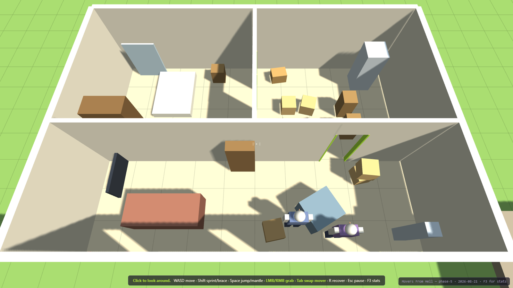

The pickup house with its ceiling hidden. Living room at the front, kitchen and bedroom
behind, and two interior doorways **on perpendicular axes** — §13.1's "doorway turn". 23
objects, from a 5 kg floor lamp to a 110 kg fridge. Getting the 2.10 m couch to the bedroom
means pivoting it round that corner through 10 mm of clearance.

### What Phase 5 added

| Piece | Where | Notes |
|---|---|---|
| The house | `src/world/house.js` | Three rooms and two openings, cut out of the partitions from one shared record so the visible gap and the collider cannot disagree (§8.1). |
| §13.2's manifest | `src/objects/definitions.js` | 23 objects: 9 boxes, 5 small, 3 medium, 3 large, 2 fragile, 1 showcase. Replacement values spanning 30x. |
| Zones + delivery | `src/contract/manifest.js` | §12.3: substantially inside, settled, for a dwell. "Substantially" is a fraction — demanding full containment would make a couch undeliverable to a small room. |
| Object recovery | `src/objects/registry.js` | §18.3. A dropped object is somewhere inconvenient, never gone (§2.2). |
| Content validators | both | Run at load in the shipping build, not only in tests (§24.4). They caught two real authoring bugs in this phase alone. |

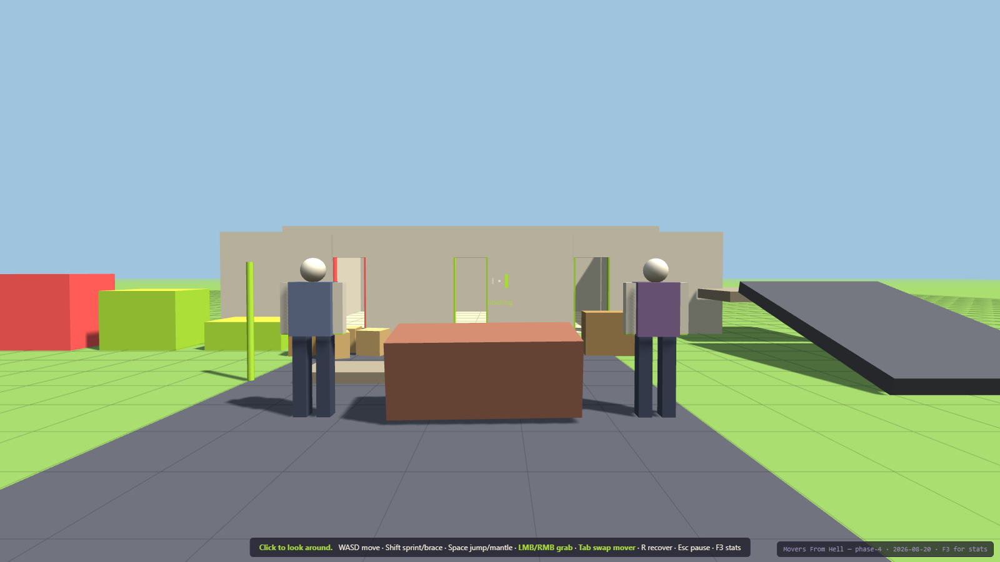

Two movers at either end of the 90 kg couch. One hand peaks at 458 N and cannot separate it
from the floor by a micron; two peak at 895 N against the couch's 883 N and lift it clear.
Nothing in the code special-cases cooperation — that is just what two springs on one rigid
body do (§6.4).

### What Phase 4 added

| Piece | Where | Notes |
|---|---|---|
| Multiple movers | `src/main.js`, `src/config.js` | Each with its own controller, grip system and colour. **Tab** swaps which one you drive. |
| Per-mover aim | `src/player/grip.js` | Each mover keeps its own yaw/pitch. Reading the shared camera rig made an inactive mover's hands swing with your view, and it applied 0 N. |
| Shared-spring damping | `src/player/grip.js` | Damping is derived from every hand on the object, not just yours. Your strength is still yours alone. |
| No ownership | everywhere | No owner field, no carry state, no synchronized animation (§14.2). Releasing one grip updates the forces within a single step. |

### What Phase 3 added

| Piece | Where | Notes |
|---|---|---|
| Heavy objects | `src/objects/definitions.js` | The §7.1 couch (90 kg) and a dresser (55 kg), both dynamic. |
| Load, pull, balance | `src/player/controller.js` | Carried weight slows you; the object's reaction tugs you; imbalance builds and can put you on the floor. |
| Stumble + knockdown | `src/player/controller.js` | §5.1's STUMBLING and RAGDOLL states, now reachable. Being knocked down drops what you held. |
| Exertion | `src/player/controller.js` | §5.2's leverage modifier — reduces grip strength while working hard, recovers fast, never blocks an action. |
| Force reset | `src/physics/world.js` | Rapier forces persist and compound; `clearForces()` is why the §6.4 bound is now real. |

### What Phase 2 added

| Piece | Where | Notes |
|---|---|---|
| Object definitions | `src/objects/definitions.js` | §7.1 data + a §24.4 validator that runs at spawn. It caught a real data error on its first run. |
| Object registry | `src/objects/registry.js` | Body, collider, mesh and runtime state as one record; collider→entity lookup for raycasts. |
| Grip system | `src/player/grip.js` | Damped spring applied AT THE GRIP POINT, so leverage and torque emerge from the physics rather than from special cases. |
| HUD | `src/ui/hud.js` | §21.1 centre reticle, per-hand state, readable without colour (§26.5). |
| Collision groups | `src/physics/world.js` | A held object stops colliding with its carrier — the fix that makes "no wall ghosting" true. |

### What Phase 1 added

| Piece | Where | Notes |
|---|---|---|
| Physics world | `src/physics/world.js` | Rapier 0.20 wrapper. Fixed timestep, velocity caps (§7.3), one place to replace at the Unity port. |
| Character controller | `src/player/controller.js` | Kinematic capsule via Rapier's `KinematicCharacterController` — collide-and-slide, autostep, ground snap. §5.1's "responsive locomotion controller". |
| Mantle | `src/player/controller.js` | Three casts: wall ahead, ledge top, headroom. Refuses above `mantleMaxHeight`. |
| Recovery | `src/player/controller.js` | §18.3 last-stable transform, banked only while settled; automatic when out of bounds, manual on R. |
| Blockout body | `src/render/playerBody.js` | Adapted from Something's Different, built facing -Z so there is no ±π offset to get wrong. |
| Test geometry | `src/render/scene.js` | Room, ramp, platform, porch step, mantle ledges — specs shared by mesh and collider. |

### What Phase 1 did NOT do

`stumbling`, `ragdoll` and `pinned` from §5.1's state table are declared but never entered.
Nothing can apply the impulses that would justify them until there are objects to collide
with, and a state you can enter but not leave is worse than one that never starts. They
arrive in Phase 3.
---

## Architecture

```
index.html          crash banner, vendored THREE, module entry
src/
  config.js         ALL tuning. §27.5 high-leverage values live here and nowhere else.
  game.js           authoritative state + fixed-step loop. Every mutation runs in step().
  main.js           boot, system registration, render loop
  core/             clock, input, eventBus, rng   — engine-agnostic, no THREE, no DOM
  physics/          world.js  — the ONLY file that imports Rapier (one seam to port)
  player/           controller.js — kinematic capsule, mantle, recovery
  render/           renderer, camera, scene, playerBody — reads state, never writes it
  dev/              debugOverlay
  objects/          definitions.js, registry.js — movable entities as data + state
  ui/               hud.js
  tools/ vehicle/ contract/ data/   — empty, one per §22.2 module
assets/lib/         vendored Three.js r128 + Rapier 0.20 — zero external requests
                    see assets/lib/NOTICE.md for provenance and licences
tools/              serve, smoketest, shot, per-phase test suites
docs/               GDD (markdown + original .docx), screenshots, changelog, issues, notes
```

Three rules keep the §22.4 multiplayer seam open even though this build is single-player:
players are keyed by stable string id, state is plain serializable data with no engine
handles in it, and systems observe state rather than owning it.

### Reuse lineage

Per `Dev\INDEX.md`, most of the scaffold was copied rather than written:

- `GameClock`, `Rng`, `EventBus`, the `Input` edge-per-step contract, the whole test
  harness (`serve.ps1` / `smoketest.ps1` / `shot.ps1`) — **Airport Baggage Crew**
- `camOcclude` analytic ray-vs-AABB — **Chameleon** (`chameleon3d.html:4198`)
- Crash banner — **Something's Different** (`somethingsdifferent.html:444`) via ABC
- Three.js r128 — the same vendored build Chameleon and Something's Different use, which
  is what lets their camera/texture/animation code drop in unported

Names were kept so the lineage stays greppable.

## Known limitations

- **Must be served over http.** ES modules are blocked on `file://`. Use `play.bat`.
- **Solo dragging of the couch is weak.** It moves but does not travel — see
  [KNOWN_ISSUES](docs/KNOWN_ISSUES.md). Lifting it with two braced hands works.
- **The ragdoll is a timed knockdown**, not a simulated jointed body. §5.1 asks for one;
  that is Unity-side work.
- **Rapier forces persist and compound** until reset — the single most surprising thing
  found so far. See `src/physics/world.js` for the measurements.
- **Rapier raycasts need a step first.** `castRay` reads a pipeline only `world.step()`
  populates, so a body spawned this step is invisible to rays until the next one. Measured;
  see `src/physics/world.js`.
- **Most of `config.js` is unvalidated.** Every block below `SIM` and `RENDER` is a named
  placeholder, labelled with the phase that will validate it. Do not quote them as balance.
- **Headless Chrome delivers 1–3 rAF callbacks total** in `--dump-dom` mode (measured; see
  `Dev\INDEX.md`). Test suites must drive `game.frame()` directly, never wait for frames.
