# Movers From Hell

### ▶ Play it: **https://dumb-tony.github.io/MoversFromHell/**

Always live, always the current `main`. Every push redeploys it — no build step, the repo
*is* the site. **Phase 10 of 13**: a house to empty, two movers, four tools, a truck with a
real cargo box, a drive that finds out how well you packed it, a second house to fill, and an
invoice that prices every mistake you made getting there. WASD move, Shift sprint/brace,
Space jump/mantle, **LMB/RMB to grab with each hand**, **E to use and Q to undo**, **Tab to
swap mover**, **F2 for two-player split-screen**, R recover, F3 stats. Start with Enter, Space, a
click or pad **A**; **F2** or pad **View** seats a second player; **R** or D-pad down recovers;
**Esc** or pad **Menu** pauses. Try carrying the couch
on your own — it will slow you down, unbalance you, and eventually put you on the floor. That
is the design, not a bug. Then grab one end, Tab to the other mover, grab the other end, and
watch it come off the ground — or press F2 and have someone else grab it.

---

> ### ⚠ What you can actually reach right now
>
> **All of it.** Phases 6–10 were built physics-first and each deferred its interface, so for
> a while the tools, straps, cargo loading, the drive and the invoice were real, measured and
> asserted — and unreachable, because none of them had an input binding. That gap is closed:
> **E does the obvious thing and Q undoes it** (§9.2), the HUD tells you which before you
> press it (§4.4), straps are drawn (§10.3), and the contract ends on a settlement screen you
> can replay from (§15.2).
>
> **It also looks like a game now.** The art direction is Overcooked's — chunky rounded
> geometry, saturated colour, hard warm light — with the crew's own toy proportions kept
> (not the stubby ones). Phase 15 gave it a material library (forty kinds, each with its own
> texture, relief and light response), variance shadows, baked and contact occlusion, and
> a post-processing chain over the backbuffer: bloom off the pendants, a warm grade and a
> seat-local vignette. `?post=off`, `?shadows=pcf`, `?style=cel` and `?style=film` are
> live for the comparisons.
>
> **And two people can play it.** Press **F2** for split-screen local co-op: P1 on WASD and
> the mouse, P2 on the arrow keys or the first controller plugged in. §6.4's two-mover
> carrying has been real and measured since Phase 4 and this is the first build in which two
> people can actually do it.
>
> What is *not* here: online play. §14.1's production target is 1–4 over Steam and nothing
> here is networked — the seams are open (§22.4) but unused. See
> [KNOWN_ISSUES.md](docs/KNOWN_ISSUES.md).

A 1–4 player physics-driven moving-company co-op game. You and your friends carry
furniture down stairs, through doorways it does not fit through, into a truck that is a
real collision volume, drive it somewhere, and find out what your packing was worth.

**North-star question:** is physically moving furniture with friends, packing a truck,
driving it, and unloading it inherently fun enough to build a full game around?

The full design authority is [`docs/GDD.md`](docs/GDD.md) (29 sections). This README
covers only how to run and build the thing.

---

## Platform strategy — read this before adding anything

This browser build is a **gameplay laboratory, not the final foundation** (GDD §13, §24).
It exists to answer the north-star question. After the core loop is proven fun, the
project transitions to a real 3D Unity PC game for Steam. Prototype code is expected to be
thrown away; validated *rules, tuning ranges and playtest evidence* are what transfer.

A feature-complete prototype that is not fun is a **failed prototype**, and should be
revised rather than expanded (§13.5).

---

## Run it

Live build, no install: **https://dumb-tony.github.io/MoversFromHell/**

Locally, for development — **double-click `play.bat`**, or:

```bash
./play.bat
```

⚠ Start it from a terminal or Explorer window you keep open. A dev server launched as a
background task from an agent session does not survive: it binds, serves correctly, and is
then torn down within a minute (observed exiting 255 and 1, with no error of its own). The
server is fine; the background lifetime is not. It also prints the port it actually got —
read that line, because several projects scan the same range.

Serving over http is required, not a convenience — the game is ES modules, and browsers
block module loads on `file://`. `play.bat` starts `tools/serve.ps1` on ports 8381–8390
and opens a tab. Those ports sit clear of Chameleon (8321–30), Something's Different
(8341–50) and Airport Baggage Crew (8361–70) so all four can run at once.

Click the canvas to capture the mouse. `Esc` or pad `Menu` pauses and shows the pause card —
Resume, Restart the contract, and Settings. Click the card to resume and re-capture the mouse;
after an Esc/Menu resume, click once to look around again. `F3` toggles the developer overlay
and the metre grid (off by default).

**The first minute** (Phase 25, M22). The first time this browser starts a job, three small
cards bottom-left walk you through the one thing that matters: look at a box and hold LMB (LT on
a pad), carry it out to the truck, then the NEXT line takes over. Each card goes when you DO it,
not when you click; the ✕ skips them; Settings → Reading the screen → tick "Show the first-minute
cards again" to see them at the next job. They never show in two-player, and turning Hints off
hides them. While a card is up the 30 s stall nudge stays quiet — one voice at a time.

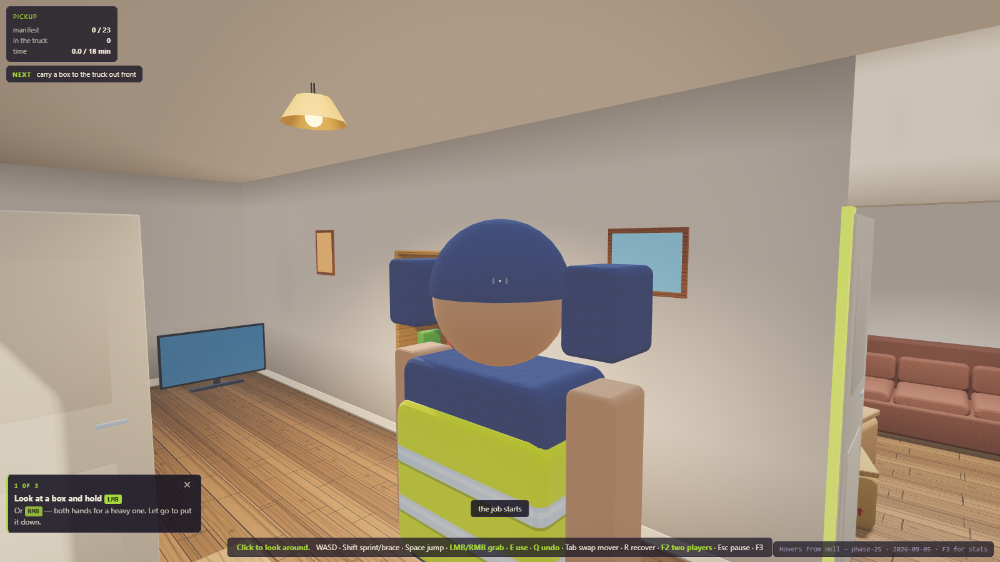

## Settings

A settings card is reachable from the title card (**Settings** under START THE JOB) and from
the pause card (Esc / Menu → Settings). Everything on it does something measurable: grab **hold
or toggle**, mouse / stick / P2-key look speed, **invert** left-right and up-down, stick
deadzone, trigger pull, **text size** (80–160 %, one CSS variable behind every font), **camera
distance** (solo boom, 1.6–7.0 m) and the render **quality tier** (auto / full / reduced —
applies on reload; `?tier=` on the URL still wins). Since then it has grown four groups:
**Controls** rebinds every on-foot action per player (Phase 23), **Sound** carries the three
buses and captions (Phase 19), **Reading the screen** carries reduced HUD, high contrast and
hints (Phase 24), and the motion switches — **camera shake** (Phase 22) and **controller
rumble** (Phase 28) — start off when your system asks for reduced motion. **Grip strength**
(Phase 28) is §6.5's accessibility assist: 1.00× / 1.25× / 1.50× on how hard your hands can
pull, bounded so one hand at maximum stays below what two hands give you and the fridge stays a
dolly job. It helps where the pull is what binds — dragging, wet surfaces, tired arms — and does
nothing to a light box, which is limited by how fast a hand can move rather than how hard it can
pull. Settings are saved on this machine under one localStorage key (`mfh.save`) together with
your **best invoice**, which the settlement sheet quotes as "best so far", and your bindings as
differences from the defaults. A retry keeps every setting (§21.2). A save from another schema, a
damaged one, or a browser that refuses storage all fall back to defaults without a crash.

**Prompts speak your device.** Every key chip, the grip label, the seat tag and the help line
are derived from the binding table for your seat and the device you last used — E · Q · LMB/RMB
on seat 0's keyboard, ' · ; · [ ] on seat 1's, X · RB · LT/RT on a pad; the switch takes a
quarter of a second so a nudged stick cannot flicker it. One line under the contract panel says
what to do next (the truck, how many to load, the road, how many to unload), every item you look
at says which room it is for, and thirty seconds into a job with nothing grabbed a single notice
names the grab buttons. Cargo glance while driving is **LB** on a pad (View is join/leave).

**Analog grip** (Phase 28). On a controller the triggers are analog: how far you pull is how hard
your hands hold, live, so easing off lowers your grip while you are carrying and a badly loaded
hand sags and then slips. Below the trigger-pull threshold the hand simply opens. Keyboard and
mouse are always a full pull — controller parity means the same actions, not the same nuance.

**A pulse in the hand that dropped it** (Phase 28). §8.4's fourth feedback channel reads the same
cue table as the sounds and the captions: impacts, damage, straps, tools, the road and the phase
stings, each on the pad of the seat it happened to — the hands that were holding it, the holder
named on a property line, or the driving seat for a road event, which is the seat the camera
shake nudges. An overstressed strap creaks in the carrier's hand for as long as it lasts. Nothing
is withheld from a keyboard: every cue that rumbles already has a sound and a caption.

**Furniture legs come off.** The couch is §7.1's own example: E with the screwdriver takes
its legs off (0.85 → 0.77 m across, 60 s billed to the clock, the notice names it) and Q puts
them back. It now starts in the kitchen behind the 34" door, so the doorway turn is the couch's
real route — 10 mm on its side intact, 90 mm with the legs off — and the 32" opening on the front
wall goes from impossible to 50 mm.

**After the invoice: seven questions and a run report.** The settlement sheet asks GDD §27.3's
seven playtest questions (five on a 1–5 scale with words at each end, two as a line of text;
Skip is a button) and has a **Copy run report (JSON)** button. The report is human-readable
JSON: build, seed, date, sim milliseconds per phase, grips, drops, recoveries, damage events,
straps by state, cargo loaded/unloaded and the worst shift in transit, the invoice to the cent,
completion, the session's restart count, your answers, and every event of the run with its time
stamp. If the clipboard is refused (plain http, an embedded pane) the report is already selected
in the box under the button. The last six run records and your answers are kept in this browser
only; **clear responses** deletes them.

**The evidence page — reading a session against §26.7** (Phase 25, M21). `docs/evidence.html`
(live: **https://dumb-tony.github.io/MoversFromHell/docs/evidence.html**; the settlement sheet's
export row links to it) takes any number of pasted run reports — one, several one after another,
or a JSON array — and renders GDD §26.7's Fun Validation Gate as a table: the six signals with
their minimum-evidence cells quoted verbatim, the measured value, PASS / NOT YET / no data, and
the runs behind each; under it the aggregates (completion, mean profit, trips, phase means,
damage and property lines, recoveries by kind, drops by reason, worst cargo shift) and the §27.3
answer histograms with the sheet's end-words. **Copy evidence report (Markdown)** produces the
paste for docs/PLAYTEST_NOTES.md. It is a static page with no build step, computed in your
browser and nowhere else — zero requests beyond its own module imports; every threshold is
`EVIDENCE` in src/config.js and is printed beside the table, so a reader can disagree with it.

**The job before you start** (Phase 26, M24). The title card carries a job sheet read from the
contract itself: payout, the time estimate the invoice bills against, the distance, what is in the
house (by category, with the heaviest thing), every door's clear width with the doors on and the
one item that does not fit its route intact (the couch — legs off), the road's three events, and
the profit to beat once you have one. **The invoice reveals itself.** At settlement the major
lines land one at a time and count up — revenue, labour, damage, fuel, what was left behind, fees,
then PROFIT or LOSS — and the full breakdown opens under them; Space, a click or any pad button
skips to the end. It has its own switch on the settings card (Reading the screen → Invoice
reveal), which starts off if your system asks for reduced motion, and `?reveal=off` in the
address still forces it off for a screenshot. Every number is the same either way: the reveal is
a curtain over the ledger, never a second sum.
**What happened** lists the run's own logged events — doors off or forced, legs off, drops, damage
with its cost, marked walls, road events, callouts — with stamps, and each row that had somebody's
hands on it names the seat: the legs, the dents and the marked walls say who, while a thrown box
and a road event say nobody, because nobody was holding them. **Run it again** keeps your
settings; tick "keep the tools on the truck" to start the next run with the tools you left in the
cargo box.

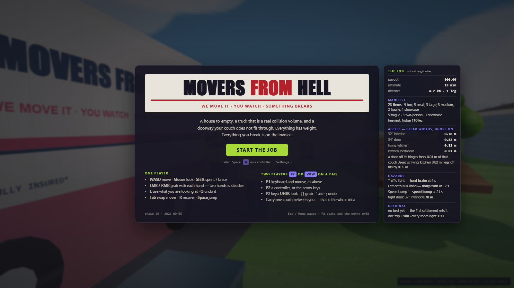

**Sound.** The game is synthesised from nothing — no audio files, no fetches. Sound starts on the
first click or key (the START button counts). Impacts thud by material and speed, a heavy carry
strains and climbs in pitch as you lose your balance, a dolly's wheels are louder the closer they
are, the truck idles and drives, a loose load rattles in the back, straps click, ratchet, creak and
snap, and the invoice has its sting. Every sound has a caption at the bottom of the screen with an
arrow to where it happened; the caption works with the volume at 0. Master, interface and world
volume and the captions switch are on the settings card and are kept between runs. `?audio=off`
disables the layer entirely.

**Doors.** Four doorways have their doors on, swung open against the jamb: the 34" door
(living → kitchen) is 0.82 m wide with its 40 mm leaf hung and 0.86 m with it off; the bedroom
door 0.87 / 0.91. With the screwdriver, **E** at a hung door takes it off its hinges (45 s of prep
on the clock) and lays it beside the doorway; **Q** at the leaf hangs it back. A removed door is
an ordinary 18 kg object: carry it, load it, lose it, dent it (a stock door survives a 1.5 m fall
scratched, 14.40, not broken) — and the customer's review says so if the front-wall door came off.
Or do not bother with the screwdriver (Phase 26, M23): shove something heavy into a hung door and
its hinges tear out — the couch, both hands, is through in a second — and the FRAME goes on the
bill as property damage, 140.00 against the screwdriver's 45 s (21.00 of two movers' labour). A
knock that does not force it bends the frame once (40.00, a mark on the leaf); a box or a mover
standing where the door hangs blocks hanging it back ("doorway blocked"). Replay hangs every door
back.

**Loose parts are real.** The screwdriver's parts come off as bodies (four 3.15 kg couch legs,
two 5.25 kg wardrobe doors, shelf boards) that must also reach the truck: a couch whose legs are
still at the pickup is not delivered, the prompt says "find the legs (1 of 4 missing)", and the
invoice bills "parts left behind" per piece from its share of the replacement value. A broken item
stays deliverable as a hulk and leaves two or three trackable fragments beside it. Reset removes
every piece.

**More than one trip.** A contract can take a second trip (§3.4): at the destination the cab
offers "drive back for N more" beside "settle up — leave N behind", the return is the same route
heading back with fuel billed per leg (2 × trips − 1) and the time on the clock, the objective
and HUD say "trip 2", and the invoice prices every item left behind at 60 each, so partial
completion is an outcome with a number on it rather than a free settlement. Leave twenty-three
behind and the job loses money, by design.

**Property damage is attributed to the surface, and to all of them.** A hit is priced on the
object's own momentum change and charged to the static surfaces the narrow phase says stopped
it, shared between them in proportion to what each took — so a couch forced through a doorway is
billed for the frame AND the wall, each with its own line, notice, mark and subtitle. The shares
add up to what one line used to cost: splitting a hit never makes it dearer. A surface stops
costing money at its maximum and does not stop responding: a further hit still marks it and
still says 'already at its maximum', while a tap too light to have cost anything stays as silent
as it always was.

**Walls are billed.** A wall, a door frame or the truck body that an object hits above 12 N·s of
the object's own lost momentum writes one property-damage entry at 1.6 per N·s (capped at 400
per surface), with a notice naming the surface ("front wall — scuffed · 30.82"), a caption, a
bounded scuff mark, the §15.1 line on the invoice and a review tag. Floors, the ground, the deck
and the ramp are never billed; a landing that grazes a wall is a landing. A door FRAME is the one surface with its own §8.3 row (Phase 26, M23): fixed charges (bent 40,
forced 140) instead of the per-N·s rate, read from the leaf's side — a hung door is a Fixed body,
so the thing shoving it loses no speed and its m·Δv reads nothing while it presses.

**Nothing you lose stays lost.** A tool, a door leaf or a loose part that leaves the world — below
the floor, past the edge of the plot, or at a position that stopped being a number — comes back
after the same four-second grace as an object (§18.3): a tool to its rack slot (detached from
whatever it was under, folded up if it was deployed, out of your hands if you were carrying it),
a removed door leaf to where it was laid down, a piece to beside wherever its parent is now.
Every callout is billed on the invoice and shown on the F3 overlay's "lost" row. A seeded sweep
of forty random sessions over the common verbs, with three things thrown into the void each,
proves no common sequence produces an unrecoverable soft lock (§26.6).

**Camera shake** is on the settings card: a small damped nudge on hard brakes, sharp turns, speed
bumps, nearby impacts and your own knockdown — never on your look — and it starts off when your
system prefers reduced motion.

**Rebind any action** (Phase 23, M18) — Settings → Controls lists every on-foot action for each
player with its keyboard/mouse chip and its pad chip. Click Rebind and press the key, mouse
button or pad button you want; Esc cancels, a click on the card cancels, and a capture closes
itself after 8 s. A key another action already has — on either player — is refused and named;
Escape, F3, F2 and the pad's View button are the game's own and cannot be bound; Pause and the
stats overlay are fixed. The reticle prompt, the grip label and the help line redraw from the
new binding at once. Saved on this machine as the differences from the defaults, so an update
that improves a default you never touched still reaches you; Reset per player or Defaults
restores the shipped keys, and a reset that knocks the other player's binding back to its
default says so on that row.

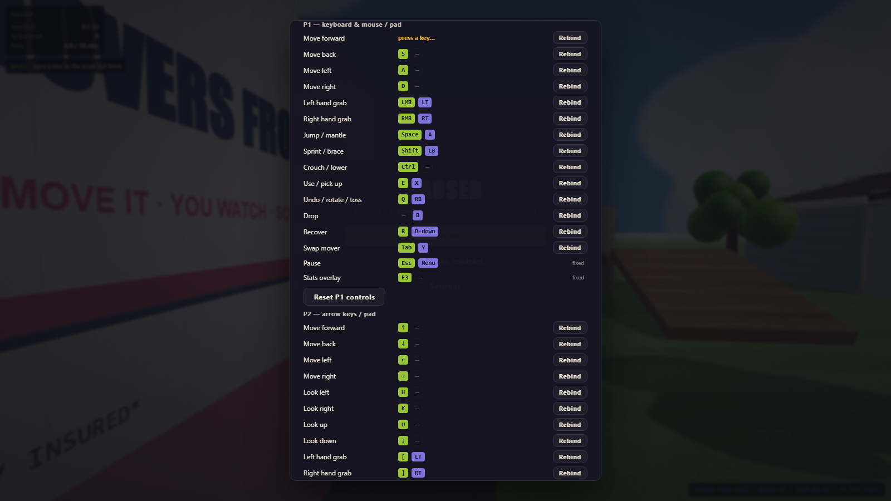

**Reading the screen** (Phase 24, M19) — a settings group with three switches. **Reduced HUD**
keeps only the objective, the prompt, the reticle, notices, the caption and the phase word with
its manifest count (an OVERTIME row stays while it is billing). **High contrast** makes every
panel opaque with white text and 2 px borders and hatches the route bar, without moving a
single panel (also `?hc=1` in the address for a screenshot). **Hints** off silences the 30 s
'how to grab' nudge at its source and the → room on each item. The pause card lists **What
happened**: the last 8 notices with the sim time they went up. Every notice leads with a glyph
(→ ✓ ✗ !) and the cargo band carries [ok] / [!] / [!!], so no state depends on colour alone.

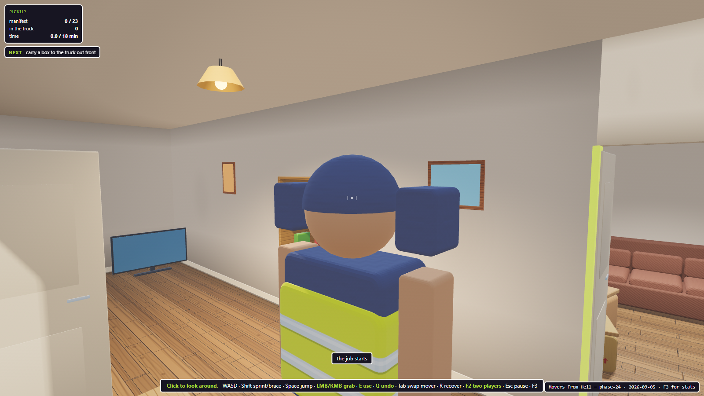

**The prompt prices what the ledger bills** (Phase 24, M20). Q on a disassembled object prices
the reattach on the line ('put the legs back on — 60 s') and bills it like the disassembly. At
the destination the cab prices every undelivered item on whichever key settles — 'settle up —
22 not delivered (1320.00), 1 still on the truck' — and that is the number the invoice bills,
from one definition both read. And the grab ray now starts from the un-nudged camera while the
picture shakes.

## Test it

```bash
powershell -ExecutionPolicy Bypass -File tools\smoketest.ps1
```

**The harness is a browser**, because the thing under test is: Rapier is WASM, Three needs a
GL context, and the HUD is DOM. The suite is injected into a scratch copy of `index.html`,
served, driven in headless Chrome, and the dumped DOM is grepped for the result block. Exit
code 0 means all assertions passed.

Node **is** installed, contrary to what this file said for eleven phases, and a syntax gate
before every browser run is worth it — ~40 ms against roughly 90 seconds to discover the
same typo as a blank page and an error banner:

```bash
./tools/syntax-check.sh
```

⚠ **Use the script, not `node --check src/foo.js`.** `--check` parses a `.js` file with the
CommonJS goal, and rather than rejecting module syntax it exits **0**. Measured with Node
v24.18.1: a file with one `import` spliced into the middle of another passed `--check` as
`.js` and failed as `.mjs`. All of `src/` is ES modules, so the cheap gate had a blind spot
shaped exactly like the code it was guarding. The script copies to `.mjs` first, which is
what actually sets the parse goal. Neither form can run the suites — no DOM, no WebGL, no
`window.THREE`.

Screenshots for docs and layout checks:

```bash
powershell -ExecutionPolicy Bypass -File tools\shot.ps1 -Setup tools\_shot-phase0.js -Out docs\phase0-scene.png
```

---

## Current state — Phase 10 complete, playable, two-player, and dressed

GDD §25.2 defines a 13-phase roadmap.

| Phase | Gate | State |
|---|---|---|
| 0. Scaffold | loads locally; stable frame/step | done — 118 assertions |
| 1. Movement | responsive indoors and on ramp | done — 61 assertions |
| 2. One box | controllable; no wall ghosting | done — 66 assertions |
| 3. Heavy object | weight legible without hard denial | done — 61 assertions |
| 4. Cooperative seam | multiple grips combine predictably | done — 59 assertions |
| 5. House puzzle | all objects recoverable and movable | done — 61 assertions |
| 6. Tools | each solves a physical problem | done — 66 assertions |
| 7. Cargo | secured pack remains stable | done — 53 assertions |
| 8. Drive | poor pack shifts or damages visibly | done — 38 assertions |
| 9. Destination | manifest completes reliably | done — 41 assertions |
| 10. Economy | ledger matches events | done — 45 assertions |
| 11. Playtest | external groups complete and replay | build side in progress — eight milestones, ordered and specified in [docs/PHASE11_PLAN.md](docs/PHASE11_PLAN.md); the playtest itself needs people |

Plus four increments that are not on the roadmap. **The playable layer** gave phases 6–10 the
input bindings and HUD each of them had deferred. **Local co-op** gave §6.4's second pair of
hands to a second person. **The art pass** dressed a build that §20.4 had deliberately kept
diagnostic for twelve phases. **The toy pass** committed that dressing to a direction, and
**the Overcooked overhaul** (Phase 15) made it a look: a material library instead of tinted
Lambert, post-processing, variance shadows, contact occlusion. None of them is §25.2's
Phase 11 — that one is the playtest, it is next, and the last three are what make it possible
to run with strangers.

**4274 assertions across forty suites, all passing** — plus a GPU-only suite that the
software harness cannot run, for the paths the tier strips there.

**Phase 11's build side has started** (the ordered plan is [docs/PHASE11_PLAN.md](docs/PHASE11_PLAN.md)).
Batch 1 shipped three of its eight milestones: the §3.4 contract machine now really runs
PICKUP → TRANSIT → DELIVERY → SETTLEMENT (the HUD names the phase, the truck's arrival raises
the unload notice, `game.state.telemetry.phaseMs` records sim time per phase, the invoice no
longer builds twice, and a tool put down with Q no longer falls through the floor); there is a
pause card with Resume and Restart, reached by Esc or a pad's Menu button, and a controller alone
can now start, pause, join and recover; and the solo couch drag was investigated to the number —
a traction budget was swept 0–560 N and every value that moved the couch tore the hold or toppled
the fridge, so the seam ships at zero with the real cause (world-frame grip damping) pinned by
test. Negative results are deliverables; the table sits beside `CARRY.tractionN`.

Batch 2 shipped three more: replay is now a full unwind through the real API (tools detached,
parts reassembled, friction and collider sizes restored, the damage ledger rebound — before this,
item damage was silently unbilled from the second run on) with a three-run soak proving every
resource count identical after run 1 and run 3; a settings card with versioned persistence
(grip mode, look speeds, invert, deadzone, text size, camera distance, quality tier, best
invoice); and prompts that speak your device, an objective line, room hints on every item, and a
stall hint. Batch 3 finished the eight: a run recorder with a Copy-to-JSON run report and
GDD §27.3's seven playtest questions on the settlement sheet (so an external group's session
arrives as data, never uploaded), and §7.1's own example built at last — the couch's legs come
off for 60 s of labour, it starts behind the 34" door, and the standing open design question
about the tight doors is resolved in KNOWN_ISSUES with the measured clearances. The eight are
done, and the plan's addendum went next: batch 4 added the sound layer (synthesised from nothing,
every cue captioned with a direction arrow, volumes and captions on the settings card) and damped
the grip spring in the hand's frame — the fix M7's numbers pointed at — so a solo couch drag now
travels (0.34 m in 3 s where it was 0.00; the dolly haul 2.1 → 6.5 m; two movers 1.3 → 5.1 m; the
fridge still 0.00 m unaided). Batch 5 made §8.2's third answer real and §9.1's loose parts
literal: four doorways have their doors on (the "impossible 32-inch door" of nine phases was the
34-inch door with its 40 mm leaf hung), the screwdriver takes a leaf off its hinges for 45 s of
labour and it becomes an 18 kg object you can carry, load or lose; and detached parts are bodies
that must also reach the truck, a broken item leaves trackable fragments, and the invoice bills
parts left behind. Batch 6 made §26.1's invoice honest: a crew can drive back for the rest
(fuel per leg, the time on the clock, "trip 2" on the HUD, every item left behind priced at 60),
and a wall, a door frame or the truck body that an object hits hard enough writes one
property-damage entry with a notice, a caption, a bounded scuff and the §15.1 line. Batch 7
closed the last two §26 lines a build can close alone: tools, door leaves and loose parts recover
from out of bounds mid-run, a seeded sweep of forty random sessions proves no common sequence
produces an unrecoverable soft lock, and camera shake exists with the switch §26.5 names. Batch 8
proved §26.3 with three packs of the same six items driven the whole route (LOW 0.030 m, TALL
0.577 m and leaning at 27°, SLIDE 1.520 m and a holed headboard; two straps take SLIDE to
0.135 m) and closed §21.4's last Input row with a Rebind on every on-foot action. Batch 9
closed the last §21.4 rows (reduced HUD, objective history, a hints switch, high contrast at
18:1) and a consistency pass (the aim ray ignores the shake, reattaching costs what removing
cost, the cab prompt's count is the invoice's). Batch 10
built the §26.7 evidence page (pasted run reports → the gate as a table, computed in the tester's
browser) and the three-card first minute that the Comprehension signal measures. Batch 11
opened §3.3's brute-force door — a two-hand shove tears a hung leaf off in 1.00 s and bills the
frame 140.00 against the screwdriver's 21.00, calibrated from the printed impulse trace — and closed
§21.2 with a job sheet beside the title card, an invoice whose major lines land one at a time over
the unchanged ledger, a recap from the run's own events and a retry that keeps the tools. Batch 12
fixed the strap that launched a light box — the damping is solved rather than sampled, so its
amplification factor is at most 1 at every mass, and a 9 kg box thrown 1.077 m at 4.27 m/s now
moves 0.025 m over a whole route while the 110 kg fridge is unchanged to half a millimetre —
and made four recorded inconsistencies true: the carry counter, notices on sim time, the holder
on the property line, and a speed bump that finally does something. Batch 13
put the trigger's pressure into the hand — a half-pulled trigger is now half the force cap, live,
with every validated grip number proven bit-identical at a full pull — added §6.5's bounded
grip-strength assist, and built §8.4's fourth feedback channel, a pad pulse routed by the same
cue table the sounds and captions read. Batch 14
made two settings keep their word — text size now scales the boxes as well as the letters, and
the quality tier rebuilds the lighting rig in the running game — and taught property damage to
tell the whole story: a corner hit is split across the surfaces that stopped it, a full surface
stops charging without going silent, and a subtitle names which wall it was. Batch 15
finished what batch 11 started — every recap row that had hands on it names the seat, the brief
refreshes after a settlement, the reveal has its own switch, and both restarts offer to keep the
tools — and closed the world's edges: a removed or forced door now picks a clear strip to lie on
rather than landing on whoever was standing there, the front door stays on the porch, and the
first-minute card gives the bottom band room in a narrow window. Batch 16 (the manifest panel
§21.2 still lacks; the impulse the solver hides) is briefed in the plan.

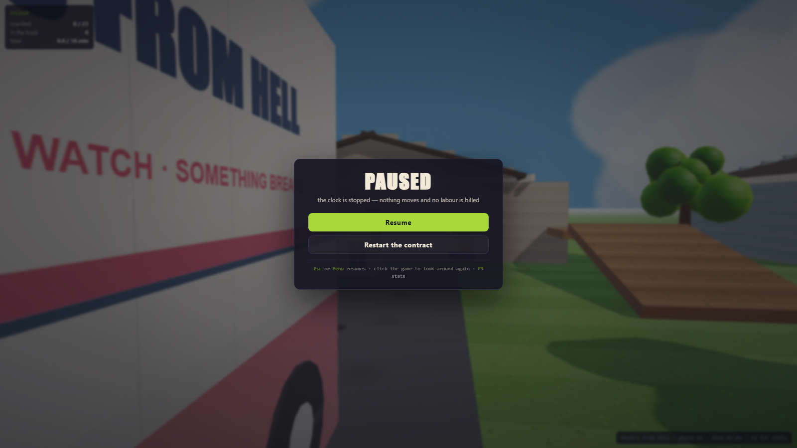

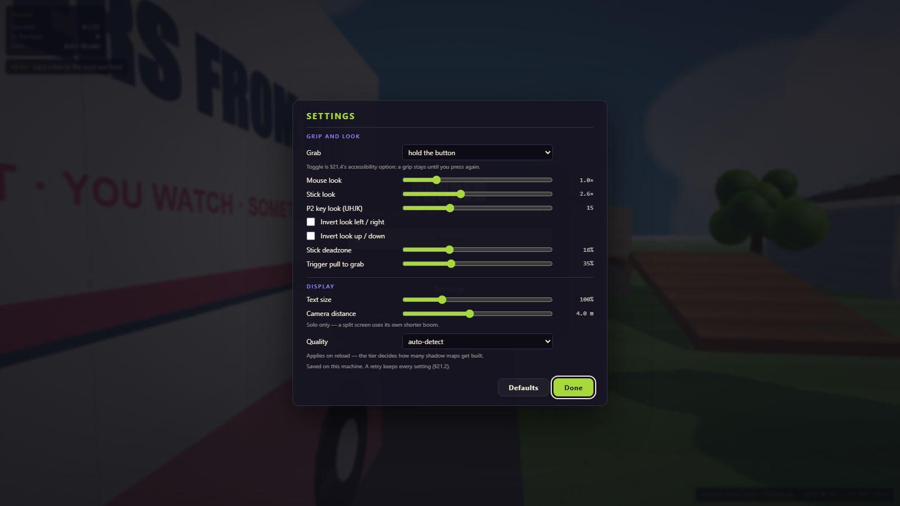

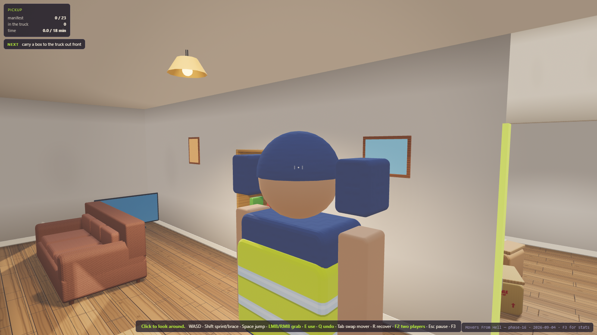

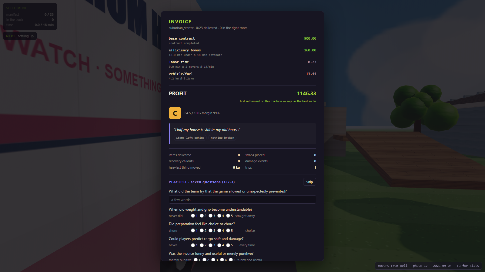

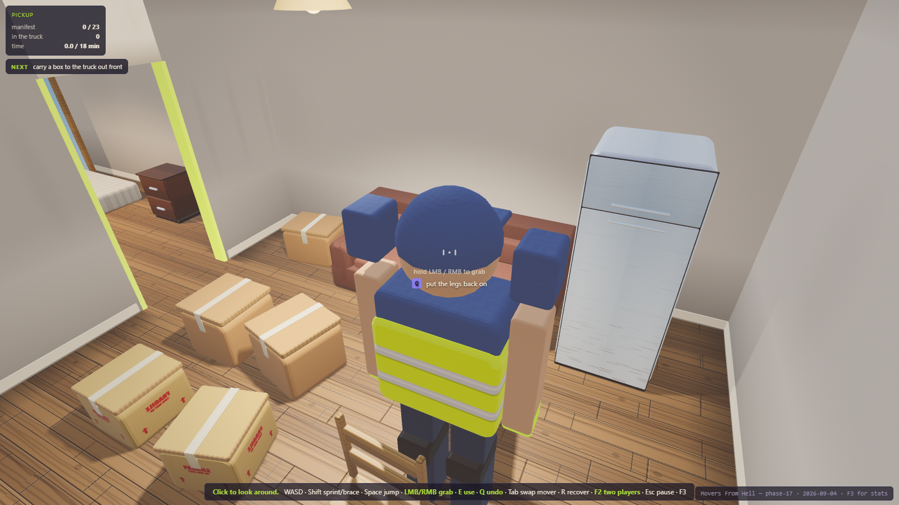

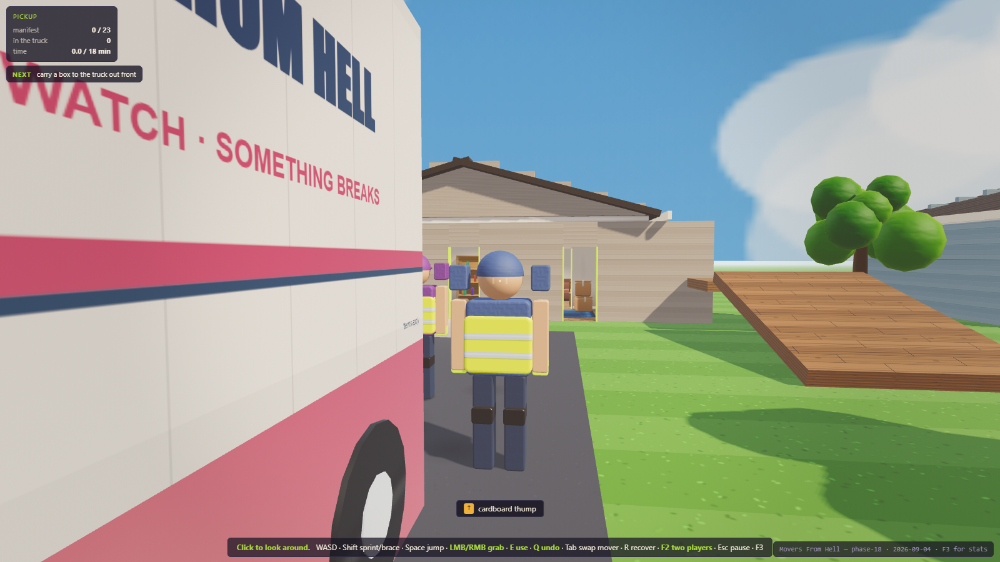

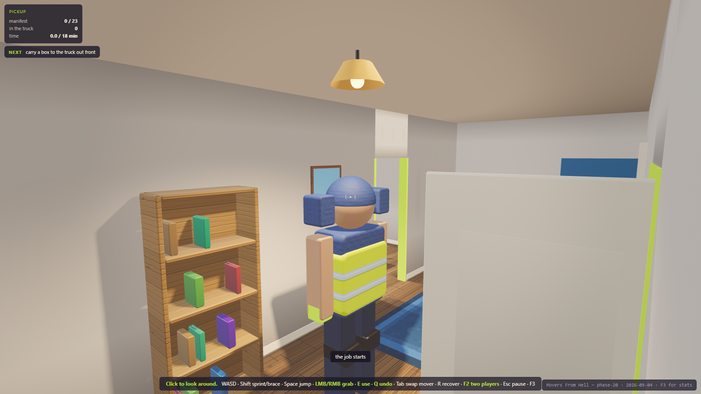

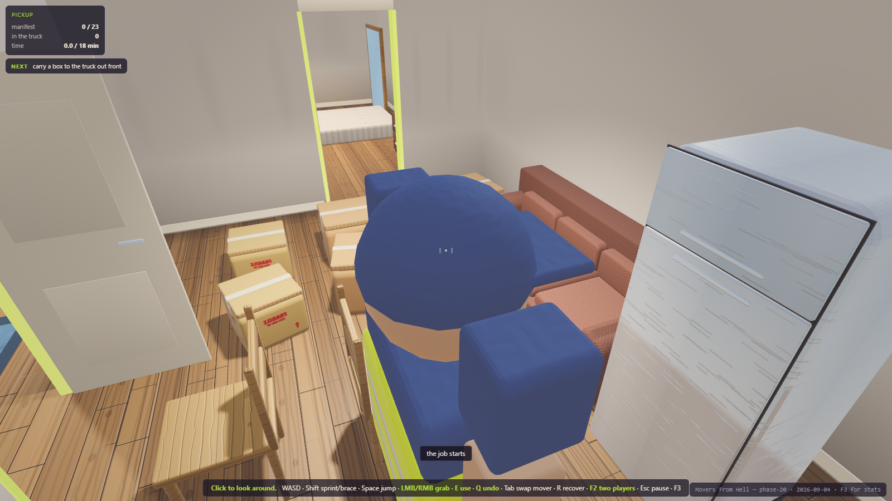

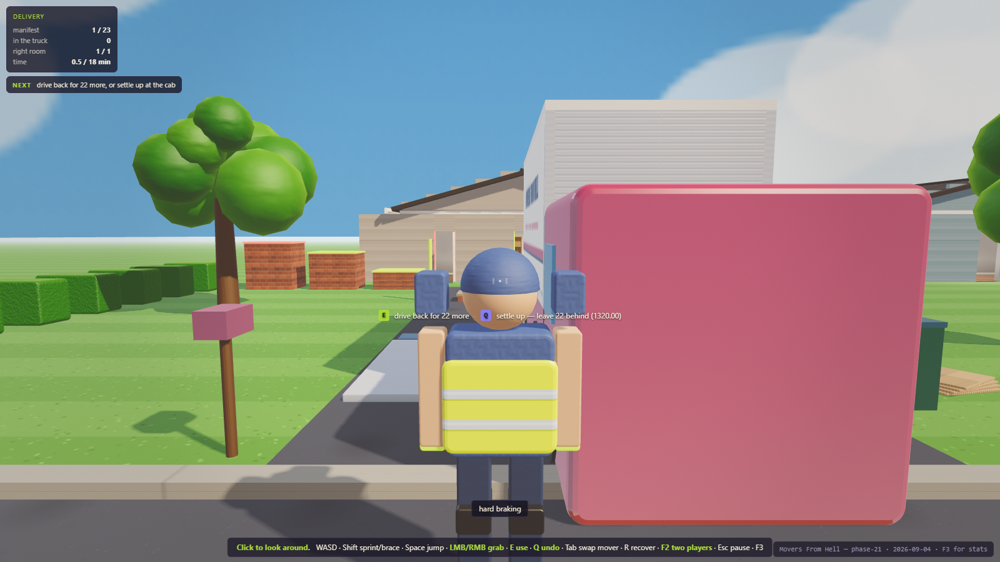

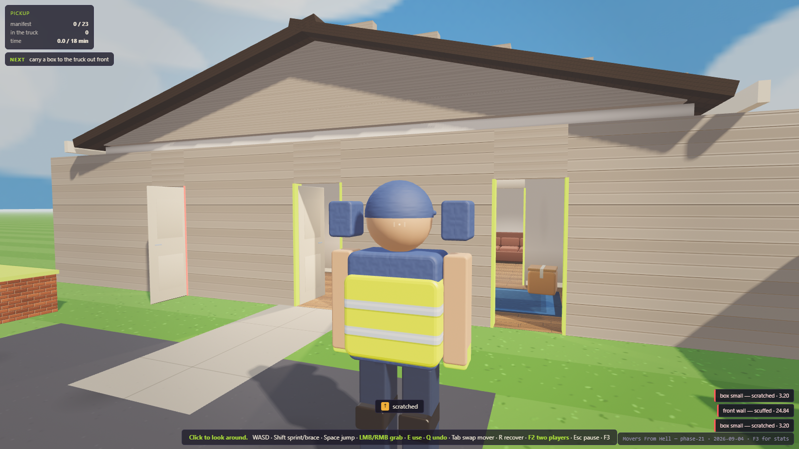

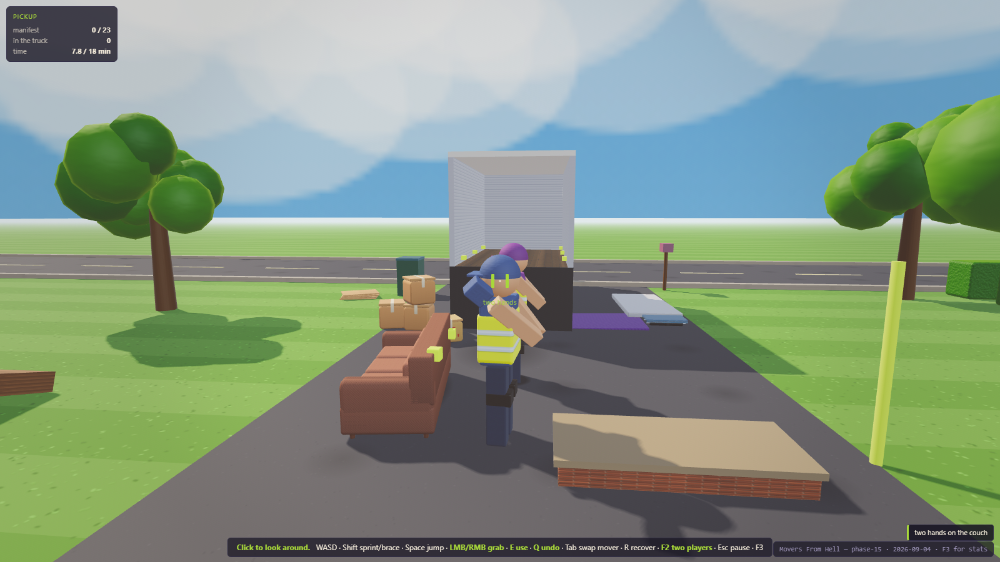

The pickup house through the post chain. Every surface names a material kind — plaster,
shingle, siding, glass, grass, asphalt, card, walnut, hi-vis — and each kind has its own
albedo texture, relief and light response, which is the direct answer to "everything reads
as different colours of the same texture" (m13 G4 asserts no two kinds share an image).
The crew keeps its toy proportions, pinned by test (G7). The couch is still exactly 2.10 m
and still will not fit the 32" door intact — with the legs off it passes by 50 mm (m6
E14/E16) — and every rounded prefab is measured against its own collider to the millimetre
(m13 A1), because §13.4's collision-faithful rule outranks any art direction.

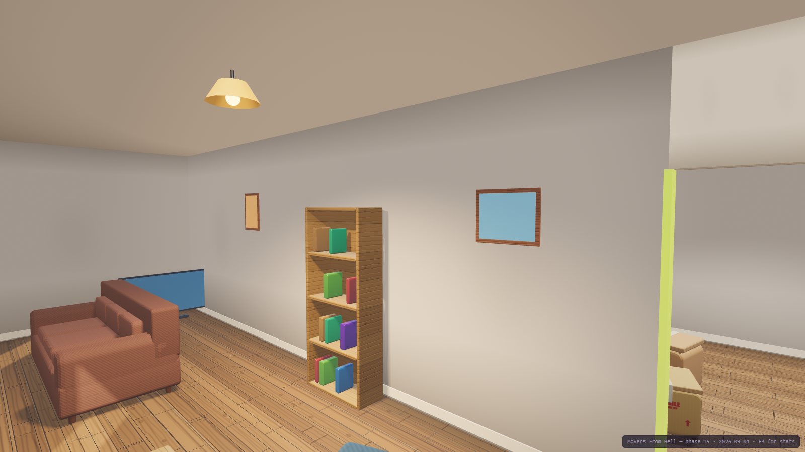

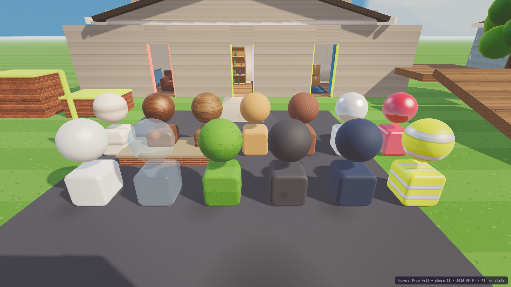

An art pass is the most dangerous change this project can make, because its mistakes are
invisible to every test that came before it — so `m13` measures the boundary between what you
see and what the physics does. **16 of 16 prefabs fit inside their own colliders to the
millimetre; zero meshes intrude on any of the three doorways; the roof, trees, hedge, street
and kerbs add zero colliders.**


The interior, which was the weakest part of the art pass until the cause turned out not to be
the lighting at all. **`MeshLambertMaterial` shades per vertex** — a wall is two triangles, so
its lighting was computed at four corners and interpolated across ten metres, and hanging
lamps in the rooms would have changed almost nothing. Surfaces are per-fragment now, each room
has a warm shadow-casting spot, and the skirting board and contact darkening are baked into
the plaster because a real-time rig with no AO pass has none of its own.


§13.4's "compact job-start screen rather than a full headquarters" — one card, one button,
and the only honest place to tell anyone that two people can play. The simulation is never
paused for it: the world behind the blur is the game running.


§6.4's worked example, with a player at each end for the first time: *"opposite-end grips
naturally stabilise long objects"*. Both halves are the shipping build's — its cameras, its
split layout, its HUDs — and both reticles read **two hands** because both movers really are
gripping the one couch. The physics under this has been right and asserted since Phase 4;
what was missing for eight phases was a second seat.

Split-screen is a **deliberate departure from §13.4**, which excludes it from the prototype.
It is recorded as a product decision in the changelog, and it is forced rather than chosen:
`GripSystem.aim()` derives its ray from the camera rig, so two movers sharing one camera aim
in the same direction and reach for the same thing.


§9.2's one interaction verb, showing its work: a mover carrying the flat dolly, looking at
the couch, with the HUD naming both halves of the decision before either key is pressed —
`E put couch 3seat on the dolly`, `Q put down the flat dolly`. Behind them the truck is
part-loaded and two straps are drawn from their anchors over the cargo (§10.3), the contract
panel is nine minutes into an eighteen-minute estimate, and the cargo panel is calling the
pack **45% unstrapped** in red. Every panel in that frame is the shipping build's own.


§15.1's invoice, on a real contract: 21 of 23 items delivered, all in the right rooms,
ninety seconds over the estimate, one television destroyed on the way in. Every line names
the events it came from — item damage is the §8.4 ledger written *as the impacts happened*,
never recomputed at settlement — and `reconcile()` re-derives the whole thing from the event
records. It refuses an invoice with a charge nothing caused, and one that drops a ledger
entry.

The result is a **630.64 loss at grade D** on a job that went almost perfectly. One broken
television is roughly the entire margin, which is not a number anyone tuned toward: §7.1's
replacement values met §15.1's labour rate and that is where it landed.


The destination with the whole manifest delivered — §13.1's "smaller site with 3-4 labeled
room zones", 54 m² against the pickup house's 70. All 23 objects settled in the rooms the
manifest asked for.

**The decision this phase had to make:** §3.4 reads wrong-room delivery as a gate, §15.1 as a
scored line, §12.2 forbids it as a hard fail. Two of three make it a price, and §2.1 breaks
the tie — **an object is delivered when it is settled inside the destination; the right room
is a separate, scored fact.** A contract completes with half the load in the wrong rooms. It
simply pays less.


What a badly packed truck looks like on arrival. Nothing here was arranged: six objects were
placed loose and high, §13.3's route applied one hard brake, one turn and one bump as real
forces, and this is where the solver left them.

| the same route, the same objects | worst shift | damage |
|---|---|---|
| good pack — heavy low and forward, strapped | 0.470 m | **none** |
| poor pack — stacked high, loose, unstrapped | **2.640 m** | television destroyed |
| **the poor pack, parked for the same 28 s** | — | **none** |

That third row is the one that matters. The pack is identically bad and the game knows it —
and nothing happens, because §10.4's physical cause is missing. Damage is never inflicted by
a score.


The cargo box through its open rear door: deck, walls, headboard, roof and six anchors, with
the load strapped down. §10.1 forbids the shortcut — "nothing teleports into storage" — so
there is no inventory here. An object is in the truck when it is physically in the truck.

### What Phase 7 added

| Piece | Where | Notes |
|---|---|---|
| The cargo box | `src/world/truck.js` | A real collision space with an open rear door and six anchors, built from the same records as its mesh. |
| Straps | `src/cargo/straps.js` | One-sided ropes with §10.3's four states. A rope pulls when taut and does nothing when slack — which is what makes "slack" a state rather than a small force. |
| Loading by physics | `src/cargo/cargo.js` | §10.2: cross the threshold AND settle inside. No slots, no grid, no snapping. |
| Per-surface friction | `src/physics/world.js` | A truck deck is 0.32, not a house floor's 0.8 — which is the actual reason real loads get strapped. |

**Measured, one §11.3 hard brake over the same six-item pack:** unstrapped worst shift
**1.645 m**; strapped **0.141 m** — both re-measured under the Phase 27 strap fix and both
unchanged, because this pack's hooks sit near each item's centre of mass and its straps were
never in the band that used to launch a light one.

**Measured (Phase 23, M17), three arrangements of the same six items over the full route:**
LOW — the fridge and dresser strapped into the headboard corner and every light item strapped
**taut** beside them (Phase 27 removed the 20 mm of slack they used to need) — worst shift
**0.029 m**, no damage, and the fastest anything strapped moves all leg is **0.217 m/s**. TALL — the fridge upright against the headboard with open
deck beside it, three boxes stacked, nothing strapped — the turn slides the fridge **0.577 m**
sideways and leaves it leaning at **27°**. SLIDE — nothing stacked, nothing strapped, the fridge
with 1.8 m of open deck ahead of it — the brake tips it forward **1.520 m** into the headboard
for a **400.00 property line**. SLIDE with two straps crossed over the fridge: the **strapped fridge** moves **0.009 m** and
leans 0.8°, no line, while the pack's worst becomes **0.374 m** and belongs to a loose box the
new speed bump walks (the published 0.135 m was the PACK's worst, never the fridge's). The §10.2 pack-quality number the HUD now prints orders them 1.000 / 0.298 / 0.199, the
same order the road does. The turn is as hard sideways as the brake is forward
(`TRUCK.roadEvents.sharpTurn.accel` 1.0): at the old 0.8 it moved nothing upright on the deck.


The four §9.1 tools on the driveway: the fridge up on the flat dolly, the loading ramp
against a 1.20 m deck, a moving blanket over the television, a screwdriver on the ground.
Each tool changes one physical quantity and nothing else — which is why each one's failure
mode is the same change seen from the other side.

### What Phase 6 added

| Piece | Where | Notes |
|---|---|---|
| Four tools | `src/tools/` | Dolly (friction), blanket (impact tolerance), ramp (clearance), screwdriver (dimensions). Real world bodies with mass — §9.2's "tools are world objects". |
| Tow speed limit | `src/player/grip.js` | You cannot walk faster than what you are towing can follow. A hand is a spring; walk past √(k/m)·maxStretch and the hold tears. |
| Impact-speed damage | `src/config.js` | Item damage keyed on speed, not impulse — impulse made a couch more fragile than glassware for being heavy. Property damage keeps the impulse, where mass belongs: since Phase 21 a wall, door frame or the truck body is billed the object's m·Δv above 12 N·s at 1.6 per N·s, capped at 400 per surface, from the narrow phase for the one step the object lost speed (`src/damage/damage.js`, `src/damage/surfaces.js`). A 9 kg box thrown at 4 m/s costs the front wall 30.82; floors, the ground, the deck and the ramp are never billed. Door frames (M23) are the exception that proves the seam: surfaces.js surfaceRow gives door_frame_<id> fixed charges, and damage.js reads the strain from the hung leaf's side of the narrow phase. |
| Friction combine fix | `src/tools/tools.js` | An object's declared friction is averaged with the floor's. The dolly switches to `Min` so its 8.75× cut is not delivered as 1.3×. |

**Measured:** couch hauled by one hand for 3 s — **0.34 m bare, 6.52 m on the dolly** (Phase 11 M10; Phase 6 measured 0.00 / 2.12). Fridge
**0.00 m → 5.37 m** (was 1.49). A 1.5 m/s knock costs a bare TV 72 condition points and a wrapped one
**zero**. A 1.20 m deck face: **0.01 m reached without a ramp, 1.22 m with one**.

**Phase 11 M10 damps the grip in the hand's frame**, and the same one-hand 3 s haul now travels:
bare couch **0.34 m unbraced** (2.45 m in 10 s, held throughout), **0.02 m braced** (bracing
anchors — braced legs walk 0.76 m/s against a 0.69 m/s haul-back, netting ~0.03), fridge **0.00 m
and 0.0° of tilt** braced or not, **two movers one hand each 5.09 m**. M7's traction seam ships at
350 N / 380 N braced; the tow cap knows the object's floor friction and caps the legs' acceleration
at 0.74 m/s² for the couch. M7's sweep, which found 0.00 m at every budget, was measuring the
world-frame damping term; its table stays beside `CARRY.tractionN` as the record.


The pickup house with its ceiling hidden. Living room at the front, kitchen and bedroom
behind, and two interior doorways **on perpendicular axes** — §13.1's "doorway turn". 23
objects, from a 5 kg floor lamp to a 110 kg fridge. Getting the 2.10 m couch to the bedroom
means pivoting it round that corner through 10 mm of clearance.

### What Phase 5 added

| Piece | Where | Notes |
|---|---|---|
| The house | `src/world/house.js` | Three rooms and two openings, cut out of the partitions from one shared record so the visible gap and the collider cannot disagree (§8.1). |
| §13.2's manifest | `src/objects/definitions.js` | 23 objects: 9 boxes, 5 small, 3 medium, 3 large, 2 fragile, 1 showcase. Replacement values spanning 30x. |
| Zones + delivery | `src/contract/manifest.js` | §12.3: substantially inside, settled, for a dwell. "Substantially" is a fraction — demanding full containment would make a couch undeliverable to a small room. |
| Object recovery | `src/objects/registry.js` | §18.3. A dropped object is somewhere inconvenient, never gone (§2.2). |
| Content validators | both | Run at load in the shipping build, not only in tests (§24.4). They caught two real authoring bugs in this phase alone. |


Two movers at either end of the 90 kg couch. One hand peaks at 458 N and cannot separate it
from the floor by a micron; two peak at 895 N against the couch's 883 N and lift it clear.
Nothing in the code special-cases cooperation — that is just what two springs on one rigid
body do (§6.4).

### What Phase 4 added

| Piece | Where | Notes |
|---|---|---|
| Multiple movers | `src/main.js`, `src/config.js` | Each with its own controller, grip system and colour. **Tab** swaps which one you drive. |
| Per-mover aim | `src/player/grip.js` | Each mover keeps its own yaw/pitch. Reading the shared camera rig made an inactive mover's hands swing with your view, and it applied 0 N. |
| Shared-spring damping | `src/player/grip.js` | Damping is derived from every hand on the object, not just yours. Your strength is still yours alone. |
| No ownership | everywhere | No owner field, no carry state, no synchronized animation (§14.2). Releasing one grip updates the forces within a single step. |

### What Phase 3 added

| Piece | Where | Notes |
|---|---|---|
| Heavy objects | `src/objects/definitions.js` | The §7.1 couch (90 kg) and a dresser (55 kg), both dynamic. |
| Load, pull, balance | `src/player/controller.js` | Carried weight slows you; the object's reaction tugs you; imbalance builds and can put you on the floor. |
| Stumble + knockdown | `src/player/controller.js` | §5.1's STUMBLING and RAGDOLL states, now reachable. Being knocked down drops what you held. |
| Exertion | `src/player/controller.js` | §5.2's leverage modifier — reduces grip strength while working hard, recovers fast, never blocks an action. |
| Force reset | `src/physics/world.js` | Rapier forces persist and compound; `clearForces()` is why the §6.4 bound is now real. |

### What Phase 2 added

| Piece | Where | Notes |
|---|---|---|
| Object definitions | `src/objects/definitions.js` | §7.1 data + a §24.4 validator that runs at spawn. It caught a real data error on its first run. |
| Object registry | `src/objects/registry.js` | Body, collider, mesh and runtime state as one record; collider→entity lookup for raycasts. |
| Grip system | `src/player/grip.js` | Damped spring applied AT THE GRIP POINT, so leverage and torque emerge from the physics rather than from special cases. |
| HUD | `src/ui/hud.js` | §21.1 centre reticle, per-hand state, readable without colour (§26.5). |
| Collision groups | `src/physics/world.js` | A held object stops colliding with its carrier — the fix that makes "no wall ghosting" true. |

### What Phase 1 added

| Piece | Where | Notes |
|---|---|---|
| Physics world | `src/physics/world.js` | Rapier 0.20 wrapper. Fixed timestep, velocity caps (§7.3), one place to replace at the Unity port. |
| Character controller | `src/player/controller.js` | Kinematic capsule via Rapier's `KinematicCharacterController` — collide-and-slide, autostep, ground snap. §5.1's "responsive locomotion controller". |
| Mantle | `src/player/controller.js` | Three casts: wall ahead, ledge top, headroom. Refuses above `mantleMaxHeight`. |
| Recovery | `src/player/controller.js` | §18.3 last-stable transform, banked only while settled; automatic when out of bounds, manual on R. |
| Blockout body | `src/render/playerBody.js` | Adapted from Something's Different, built facing -Z so there is no ±π offset to get wrong. |
| Test geometry | `src/render/scene.js` | Room, ramp, platform, porch step, mantle ledges — specs shared by mesh and collider. |

### What Phase 1 did NOT do

`stumbling`, `ragdoll` and `pinned` from §5.1's state table are declared but never entered.
Nothing can apply the impulses that would justify them until there are objects to collide
with, and a state you can enter but not leave is worse than one that never starts. They
arrive in Phase 3.
---

## Architecture

```
index.html          crash banner, vendored THREE, module entry
src/
  config.js         ALL tuning. §27.5 high-leverage values live here and nowhere else.
  game.js           authoritative state + fixed-step loop. Every mutation runs in step().
  main.js           boot, system registration, render loop
  core/             clock, input, eventBus, rng   — engine-agnostic, no THREE, no DOM
  physics/          world.js  — the ONLY file that imports Rapier (one seam to port)
  player/           controller.js — kinematic capsule, mantle, recovery
  render/           renderer, camera, scene, playerBody — reads state, never writes it
  dev/              debugOverlay
  objects/          definitions.js, registry.js — movable entities as data + state
  ui/               hud.js
  tools/ vehicle/ contract/ data/   — empty, one per §22.2 module
assets/lib/         vendored Three.js r128 + Rapier 0.20 — zero external requests
                    see assets/lib/NOTICE.md for provenance and licences
tools/              serve, smoketest, shot, per-phase test suites
docs/               GDD (markdown + original .docx), screenshots, changelog, issues, notes
```

Three rules keep the §22.4 multiplayer seam open even though this build is single-player:
players are keyed by stable string id, state is plain serializable data with no engine
handles in it, and systems observe state rather than owning it.

### Reuse lineage

Per `Dev\INDEX.md`, most of the scaffold was copied rather than written:

- `GameClock`, `Rng`, `EventBus`, the `Input` edge-per-step contract, the whole test
  harness (`serve.ps1` / `smoketest.ps1` / `shot.ps1`) — **Airport Baggage Crew**
- `camOcclude` analytic ray-vs-AABB — **Chameleon** (`chameleon3d.html:4198`)
- Crash banner — **Something's Different** (`somethingsdifferent.html:444`) via ABC
- Three.js r128 — the same vendored build Chameleon and Something's Different use, which
  is what lets their camera/texture/animation code drop in unported

Names were kept so the lineage stays greppable.

## Known limitations

- **A live quality switch changes the lights, not the surfaces.** Room lights, shadow maps, the
  shadow filter and the post chain rebuild as you pick; bump, gloss and reflections are minted
  before the scene is built and follow the next reload. Switching up also leaves twenty-five
  geometries resident that a reduced boot never uploads — not a leak, but a count that does not
  come back down.
- **A property line reports the split of the hardest step** in its window rather than a running
  average, and the settlement recap shows at most three property rows, so a capped row can fall
  off a long list. The amounts are exact either way, and the invoice line always names how many
  surfaces reached their cap.
- **Rumble has never touched a real controller.** There is no gamepad on the build machine, so
  every assertion runs against a stubbed actuator through the real polling path: the routing,
  the rate limiting and the failure modes are proven, the magnitudes are not tuned. A pad or
  browser without a vibration actuator gets silence by design. A cue nobody was holding — a
  dropped box has no holder by the time it lands — rumbles every seat, which is right in solo
  and arguably noise in two-player, and the pulse does not get harder when the hit is harder.
- **The grip assist is inert where a second limit binds.** It multiplies the force cap, so it
  cannot make a hand faster (a light box is acceleration-limited) and it never touches the
  spring's stretch band, which is what keeps every one-hand lift where it is. Turning it up
  feels like nothing on a box; that is the bound working.
- **Cargo tuning has one hard edge (M17).** A sideways fall in the 2.10 m box caps near 31°
  because the fridge's top meets the far wall. The strap that used to launch a light box is
  fixed (Phase 27) and the speed bump now takes the weight off the deck rather than doing
  nothing. **Rebinding (M18)** keeps one binding per device class per action, chords are not
  bindings (the first keydown wins), and only the on-foot table is listed.
- **The seat that feels road events** is the one whose mover stood nearest the cab when the
  drive began; shake intensity is on/off only. The shake moves the picture, never the aim: the
  grab ray starts from the un-nudged camera (Phase 24).
- **Nothing is uploaded, ever.** The project rule is zero external requests, so §27.4's
  "opt-in upload" is the Copy button; a playtest group sends the pasted JSON by hand. The
  recorder's frame cost was measured in a real Chrome (0.03 ms per step at worst), not in the
  harness, where virtual time freezes the clock. The report's
  `briefing` / `settlement` phases are always 0 in this build.

- **Replay is a full unwind** (Phase 11 M2): tools are detached and retrieved, parts
  reassembled, friction and collider sizes restored, recoveries zeroed, the damage ledger
  rebound; `tools/m14-soak-tests.js` proves bodies, colliders, scene objects, GPU
  geometries/textures and the strap render pool are identical after run 1 and run 3. Tools
  still have no out-of-bounds recovery mid-run; they return to the rack only on replay.

- **An Esc-resume cannot re-lock the pointer** (a Chrome rule: Escape is not user activation) —
  click once. Pause is global in local co-op. Pad View both joins a second player and glances at
  the cargo while driving.
- **`telemetry.phaseMs.briefing` and `.settlement` are always 0** in this build: boot skips
  BRIEFING and settlement pauses the clock.

- **Must be served over http.** ES modules are blocked on `file://`. Use `play.bat`.
- **Bracing does not make a solo drag faster** — braced towing is an anchor (0.02 m in 3 s vs
  0.34 m unbraced; legs 0.76 m/s against a 0.69 m/s haul-back), and a braced budget high enough to
  change that topples the fridge (420 N: over at 6.8 s). A lone mover who grabs the fridge HIGH
  (1.2 m) can tip it over in 7 s — a §2.2 consequence, not prevented.
- **Sound is synthesised from nothing** and starts on the first click or key; a controller-only
  start arms it suspended until the first click or key, captions are timed on sim time and freeze
  while paused, and `?audio=off` also removes the captions (use the Captions switch instead). No
  music layer, no haptics.
- **The ragdoll is a timed knockdown**, not a simulated jointed body. §5.1 asks for one;
  that is Unity-side work.
- **Rapier forces persist and compound** until reset — the single most surprising thing
  found so far. See `src/physics/world.js` for the measurements.
- **Rapier raycasts need a step first.** `castRay` reads a pipeline only `world.step()`
  populates, so a body spawned this step is invisible to rays until the next one. Measured;
  see `src/physics/world.js`.
- **Most of `config.js` is unvalidated.** Every block below `SIM` and `RENDER` is a named
  placeholder, labelled with the phase that will validate it. Do not quote them as balance.
- **Headless Chrome delivers 1–3 rAF callbacks total** in `--dump-dom` mode (measured; see
  `Dev\INDEX.md`). Test suites must drive `game.frame()` directly, never wait for frames.
