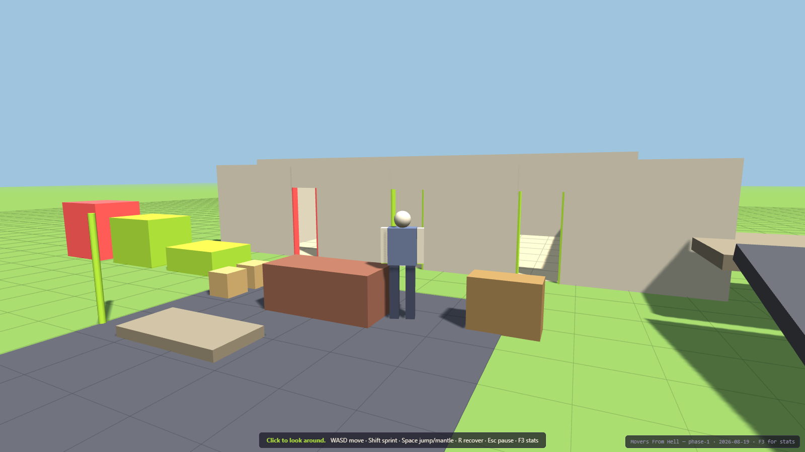

# Movers From Hell

### ▶ Play it: **https://dumb-tony.github.io/MoversFromHell/**

Always live, always the current `main`. Every push redeploys it — no build step, the repo
*is* the site. **Phase 1 of 13**: there is a mover you can actually walk around. WASD to
move, Shift to sprint, Space to jump and mantle, R to recover, F3 for stats.
Nothing can be picked up yet — grabbing is Phase 2.

---

A 1–4 player physics-driven moving-company co-op game. You and your friends carry
furniture down stairs, through doorways it does not fit through, into a truck that is a
real collision volume, drive it somewhere, and find out what your packing was worth.

**North-star question:** is physically moving furniture with friends, packing a truck,
driving it, and unloading it inherently fun enough to build a full game around?

The full design authority is [`docs/GDD.md`](docs/GDD.md) (29 sections). This README
covers only how to run and build the thing.

---

## Platform strategy — read this before adding anything

This browser build is a **gameplay laboratory, not the final foundation** (GDD §13, §24).
It exists to answer the north-star question. After the core loop is proven fun, the
project transitions to a real 3D Unity PC game for Steam. Prototype code is expected to be
thrown away; validated *rules, tuning ranges and playtest evidence* are what transfer.

A feature-complete prototype that is not fun is a **failed prototype**, and should be
revised rather than expanded (§13.5).

---

## Run it

Live build, no install: **https://dumb-tony.github.io/MoversFromHell/**

Locally, for development:

```bash
./play.bat
```

Serving over http is required, not a convenience — the game is ES modules, and browsers
block module loads on `file://`. `play.bat` starts `tools/serve.ps1` on ports 8381–8390
and opens a tab. Those ports sit clear of Chameleon (8321–30), Something's Different
(8341–50) and Airport Baggage Crew (8361–70) so all four can run at once.

Click the canvas to capture the mouse. `Esc` pauses and releases it. `F3` toggles the
developer overlay.

## Test it

```bash
powershell -ExecutionPolicy Bypass -File tools\smoketest.ps1
```

There is no Node.js on this machine, so **the harness is a browser**: it injects the suite
into a scratch copy of `index.html`, serves it, drives it in headless Chrome, and greps the
dumped DOM. Exit code 0 means all assertions passed.

Screenshots for docs and layout checks:

```bash
powershell -ExecutionPolicy Bypass -File tools\shot.ps1 -Setup tools\_shot-phase0.js -Out docs\phase0-scene.png
```

---

## Current state — Phase 1 complete

GDD §25.2 defines a 13-phase roadmap.

| Phase | Gate | State |
|---|---|---|
| 0. Scaffold | loads locally; stable frame/step | done — 118 assertions |
| 1. Movement | responsive indoors and on ramp | done — 61 assertions |
| 2. One box | freeform two-hand grip; no wall ghosting | next |

**179 assertions across both suites, all passing.**



A 1.80 m mover beside the 2.10 m couch, the three doorways, the mantle ledges (lime
climbable, red refuses) and the ramp — all at true scale on a metre grid.

### What Phase 1 added

| Piece | Where | Notes |
|---|---|---|
| Physics world | `src/physics/world.js` | Rapier 0.20 wrapper. Fixed timestep, velocity caps (§7.3), one place to replace at the Unity port. |
| Character controller | `src/player/controller.js` | Kinematic capsule via Rapier's `KinematicCharacterController` — collide-and-slide, autostep, ground snap. §5.1's "responsive locomotion controller". |
| Mantle | `src/player/controller.js` | Three casts: wall ahead, ledge top, headroom. Refuses above `mantleMaxHeight`. |
| Recovery | `src/player/controller.js` | §18.3 last-stable transform, banked only while settled; automatic when out of bounds, manual on R. |
| Blockout body | `src/render/playerBody.js` | Adapted from Something's Different, built facing -Z so there is no ±π offset to get wrong. |
| Test geometry | `src/render/scene.js` | Room, ramp, platform, porch step, mantle ledges — specs shared by mesh and collider. |

### What Phase 1 did NOT do

`stumbling`, `ragdoll` and `pinned` from §5.1's state table are declared but never entered.
Nothing can apply the impulses that would justify them until there are objects to collide
with, and a state you can enter but not leave is worse than one that never starts. They
arrive in Phase 3.
---

## Architecture

```
index.html          crash banner, vendored THREE, module entry
src/
  config.js         ALL tuning. §27.5 high-leverage values live here and nowhere else.
  game.js           authoritative state + fixed-step loop. Every mutation runs in step().
  main.js           boot, system registration, render loop
  core/             clock, input, eventBus, rng   — engine-agnostic, no THREE, no DOM
  physics/          world.js  — the ONLY file that imports Rapier (one seam to port)
  player/           controller.js — kinematic capsule, mantle, recovery
  render/           renderer, camera, scene, playerBody — reads state, never writes it
  dev/              debugOverlay
  objects/ tools/ vehicle/ contract/ ui/ data/   — empty, one per §22.2 module
assets/lib/         vendored Three.js r128 + Rapier 0.20 — zero external requests
                    see assets/lib/NOTICE.md for provenance and licences
tools/              serve, smoketest, shot, per-phase test suites
docs/               GDD (markdown + original .docx), screenshots, changelog, issues, notes
```

Three rules keep the §22.4 multiplayer seam open even though this build is single-player:
players are keyed by stable string id, state is plain serializable data with no engine
handles in it, and systems observe state rather than owning it.

### Reuse lineage

Per `Dev\INDEX.md`, most of the scaffold was copied rather than written:

- `GameClock`, `Rng`, `EventBus`, the `Input` edge-per-step contract, the whole test
  harness (`serve.ps1` / `smoketest.ps1` / `shot.ps1`) — **Airport Baggage Crew**
- `camOcclude` analytic ray-vs-AABB — **Chameleon** (`chameleon3d.html:4198`)
- Crash banner — **Something's Different** (`somethingsdifferent.html:444`) via ABC
- Three.js r128 — the same vendored build Chameleon and Something's Different use, which
  is what lets their camera/texture/animation code drop in unported

Names were kept so the lineage stays greppable.

## Known limitations

- **Must be served over http.** ES modules are blocked on `file://`. Use `play.bat`.
- **Nothing can be picked up yet.** Grabbing is Phase 2; §5.1's stumble and ragdoll states
  are declared but unreachable until Phase 3.
- **Rapier raycasts need a step first.** `castRay` reads a pipeline only `world.step()`
  populates, so a body spawned this step is invisible to rays until the next one. Measured;
  see `src/physics/world.js`.
- **Most of `config.js` is unvalidated.** Every block below `SIM` and `RENDER` is a named
  placeholder, labelled with the phase that will validate it. Do not quote them as balance.
- **Headless Chrome delivers 1–3 rAF callbacks total** in `--dump-dom` mode (measured; see
  `Dev\INDEX.md`). Test suites must drive `game.frame()` directly, never wait for frames.
